# Django-通过示例定制admin后台管理


## 后台管理改为中文

```python
#  将 setting.py  配置选项设置为中文
LANGUAGE_CODE = 'en-us'
TIME_ZONE = 'UTC'

LANGUAGE_CODE = 'zh-Hans'
TIME_ZONE = 'Asia/Shanghai'
```

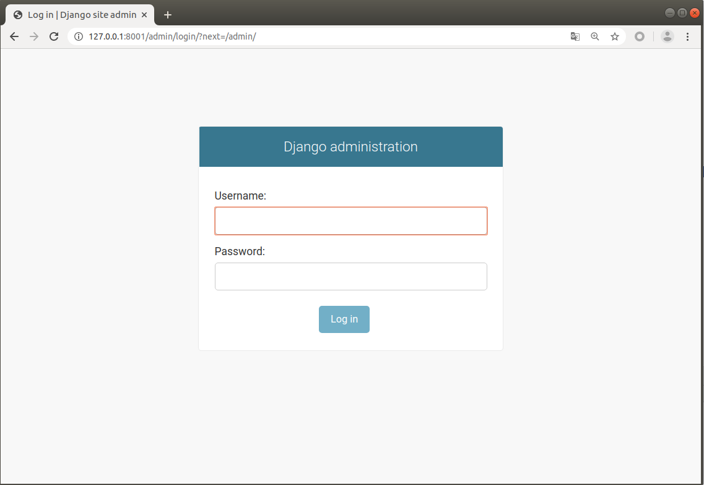

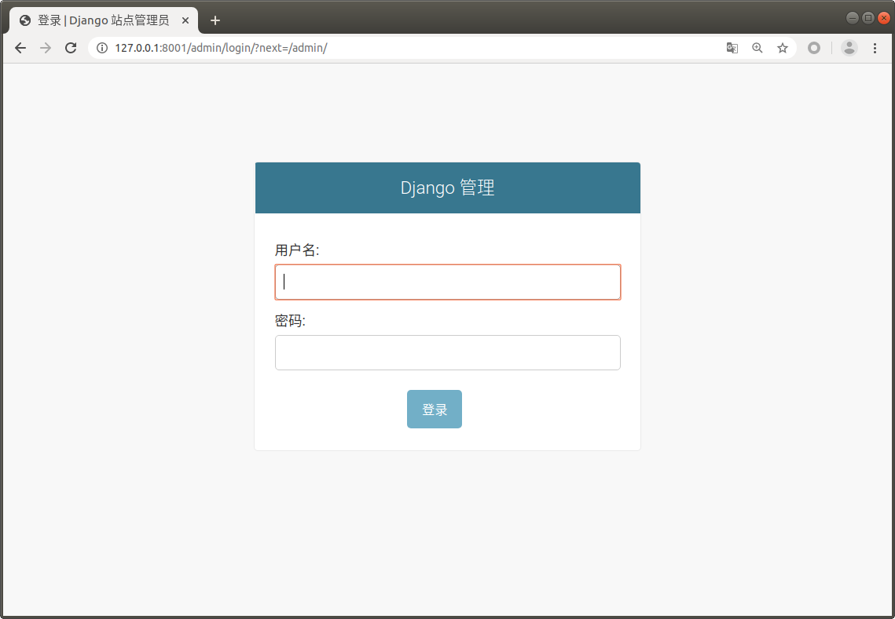


## 更改后台标题和名称（title/header）

```python 
# admin.py 文件添加 修改网页title和站点header
admin.site.site_header = 'XXX平台-管理系统'
admin.site.site_title = 'XXX平台'
```
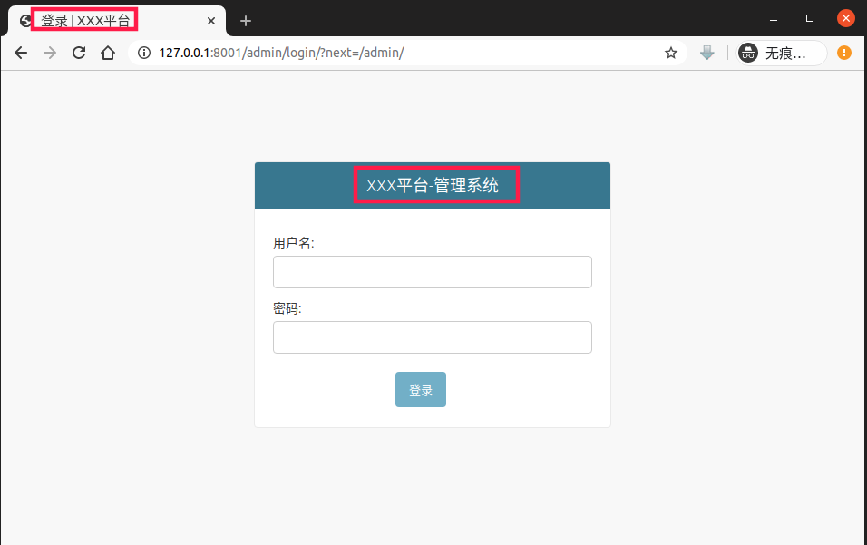

## 创建Admin 超级管理员账号
```bash
python manage.py createsuperuser
```


## 将数据表添加到站点管理

1. 在`settings.py`文件,`INSTALLED_APPS` 加入该app.
2. 定义模型写入`models.py`
```python
from django.db import models
lass Question(models.Model):
    question_text = models.CharField('问题描述',max_length=200)
    pub_date = models.DateTimeField('发布日期')
```
3. 在该app目录的`admin.py`文件下注册
```python
from django.contrib import admin
from .models import Question
class QuestionAdmin(admin.ModelAdmin):
    pass

admin.site.register(Question, QuestionAdmin)
```

## 更改APP的名称
写入该app的`__init__`文件,更改默认配置。
```python
from django.apps import AppConfig

default_app_config = 'polls.PollsConfig'
class PollsConfig(AppConfig):
    name = 'polls'
    verbose_name='投票'

```
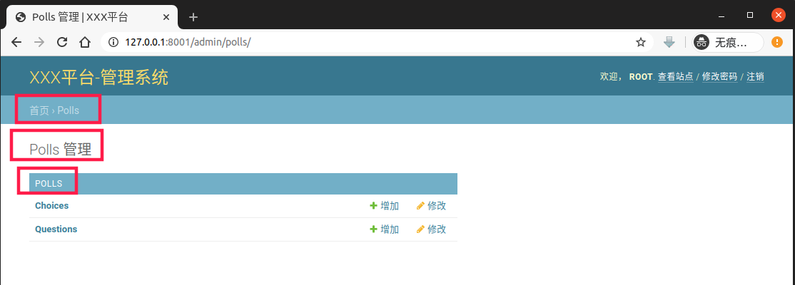
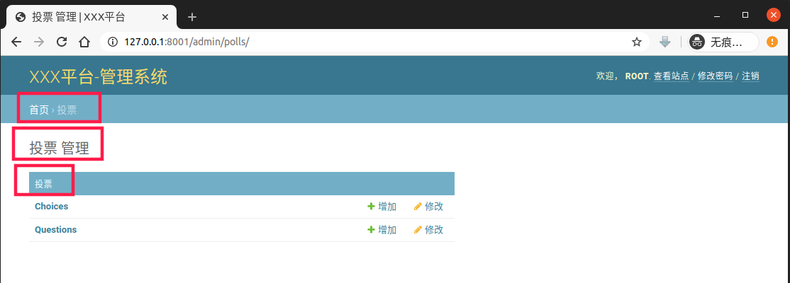

## 更改Model模型名称

```python
class Question(models.Model):
    # 在该模型定义加入内嵌类定义元数据👇
    class Meta:
        verbose_name = '问题'
        verbose_name_plural = verbose_name

    question_text = models.CharField('问题描述',max_length=200)
    pub_date = models.DateTimeField('发布日期')
```
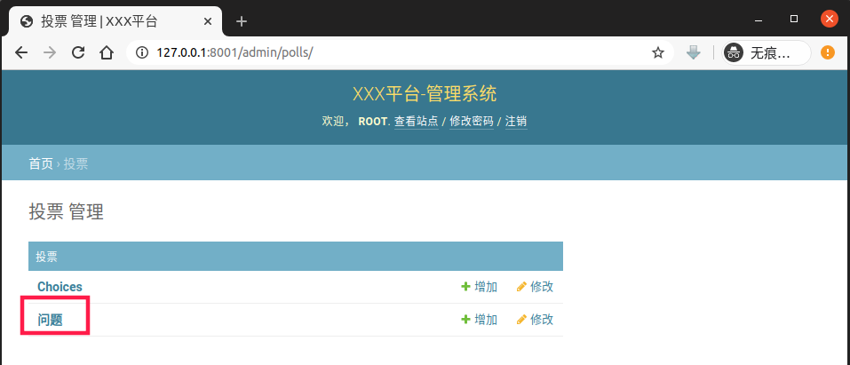

## 数据记录对象以字段显示
写入 `admin.py` 下的 `QuestionAdmin`类：
```python
list_display = ('question_text', 'pub_date')
```
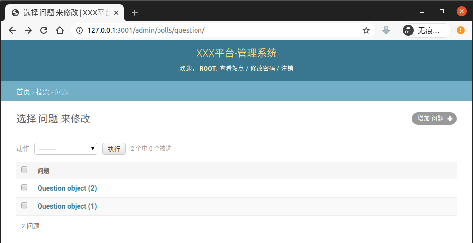
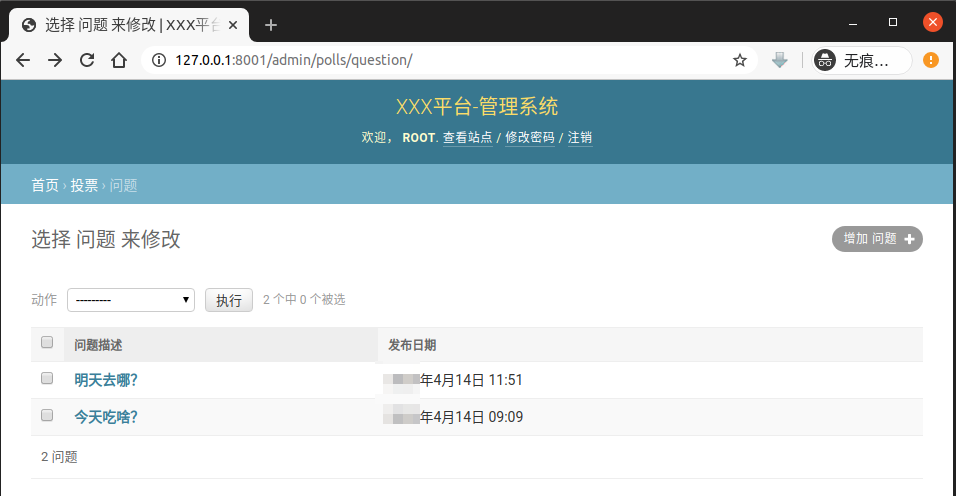

## 增加按照时间的过滤器
```python
list_filter = ['pub_date']
```
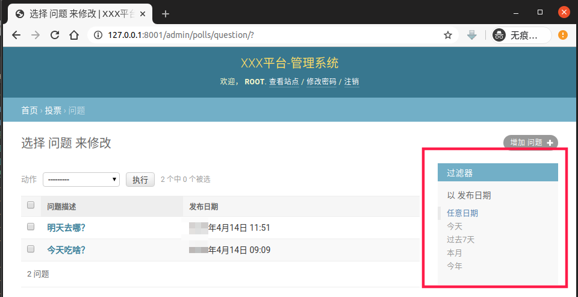

## 增加按照问题描述的模糊搜索
```python
search_fields = ['question_text']
```
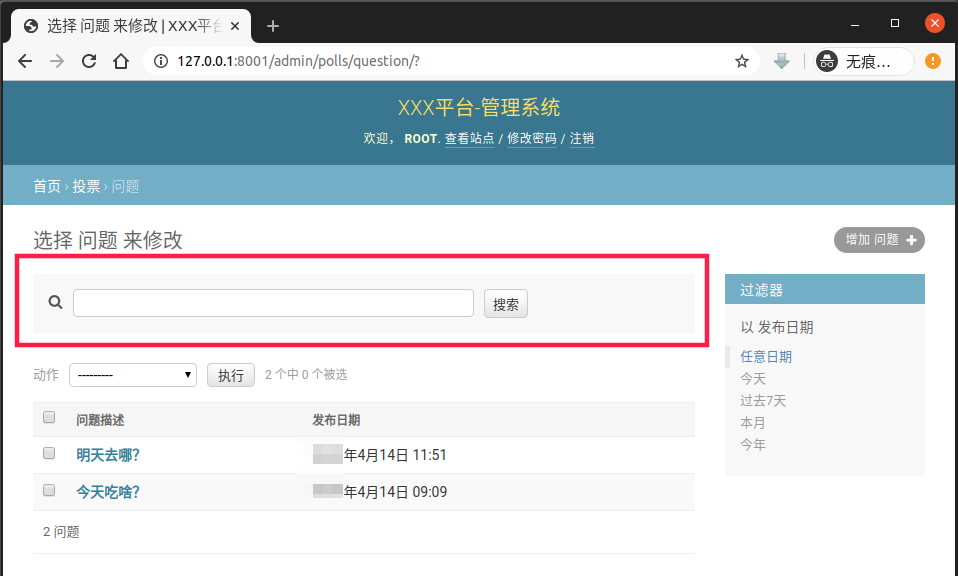

## 增加显示详细日期的筛选模块
```python
date_hierarchy = 'pub_date'
```
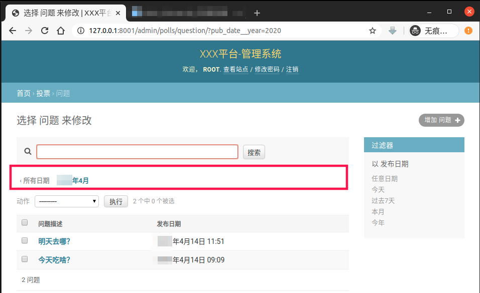


## 图像预览显示

