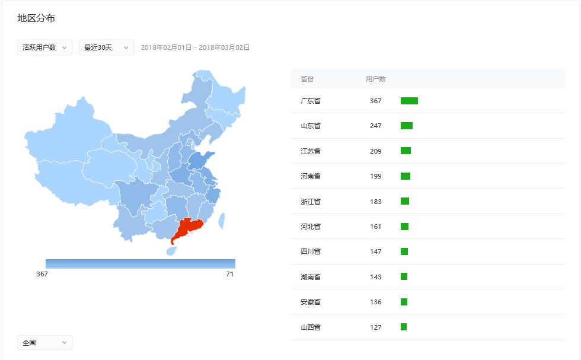

# 小程序"生命数计算器"用户画像分析(1-2月)

- 微信小程序"生命数计算器"是一个根据"生日","星座"来分析性格特点，爱情匹配等信息的一款“娱乐玄学”小应用。

### 年龄分布

- **恋爱窗口期与年龄分布：**两性恋爱中有一种观点是18-25岁是一个恋爱活跃的窗口。24岁正是大学毕业后开始为事业忙碌奋斗的时刻。到了30岁心智更加成熟，也会有一定的财富积累，这个时候会打开第二个窗口期。从图中可以看出的分布走势呈M型，和这一观点非常吻合。是对这一观点的又一有力佐证。(所以呀，25岁还没找到异性朋友就再等5年吧！[自嘲脸])

- **性别分布：**按照一般的固有思想，这类“玄学”类的应用女性用的会比较多，然而从统计分布图上来看男女比例相等，甚至男性用户还多一些，很有意思。数据还是很合理。

### 地区分布

- 从地区分布图看广东省top1,是"广东省更相信风水"的又一个佐证。为什么"广东省更相信风水"？
来自知乎讨论：
> 因为广东香港远离中原，自古所受的战乱不多，传统习俗保存得比较完整，你试看看粤语就知道了，它保留的口音是唐代以前的，称得上是活文物了。尤其是文革那个疯狂的年代，广东这里所受的冲击，相比于北方，不算太大的，传统文化或习俗很大没有被清洗。所以也是万幸的事了。这样，风水的习俗在广东依然盛行就不为怪。
> 
> 作者：梁巷华
链接：https://www.zhihu.com/question/20004702/answer/13914692
来源：知乎
著作权归作者所有。商业转载请联系作者获得授权，非商业转载请注明出处。

### 迷之凸起

- 一月25日有一个用户访问高峰，这一天既不是假日，也不是重大节日。很奇怪造成这个异常点的原因。
