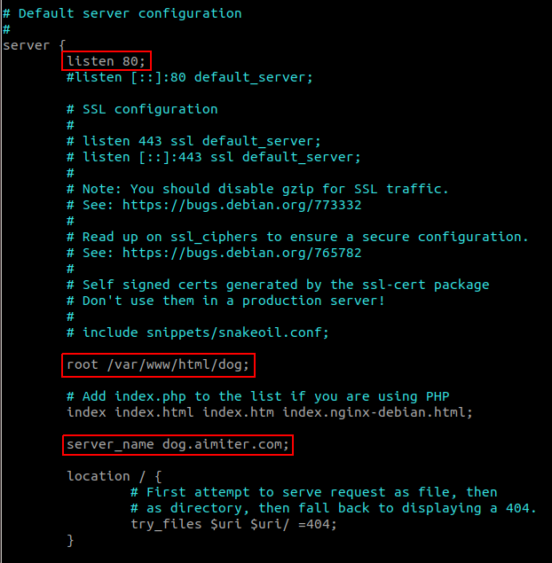

# Nginx为多个不同的静态资源配置不同的二级域名

有多个域名:
dog.aimiter.com
cat .aimiter.com
...
需要映射到不同的静态资源目录:
/var/www/html/dog
/var/www/html/cat

配置如下:

分别建立nginx配置 dog.conf, cat.conf.
然后只需设置静态资源目录`root` 和 域名地址`server_name`即可.
