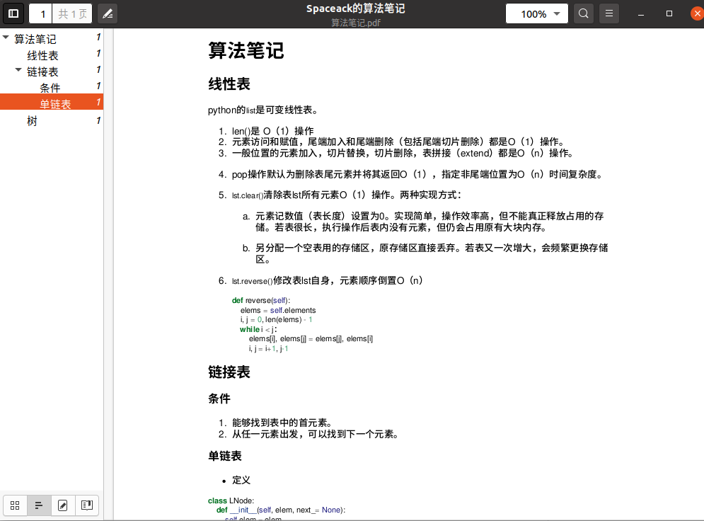

# 使用pandoc将markdown转为带标签目录的pdf文件


- step1: 安装pandoc
```bash
sudo apt install pandoc
```
- step2: 安装转换pdf引擎 wkhtmltopdf
[下载地址](https://wkhtmltopdf.org/downloads.html)

- step3: 执行转换
```bash
pandoc --pdf-engine=wkhtmltopdf --metadata pagetitle="Spaceack的算法笔记"  算法笔记.md -o 算法笔记.pdf
```
## 示例：

  


