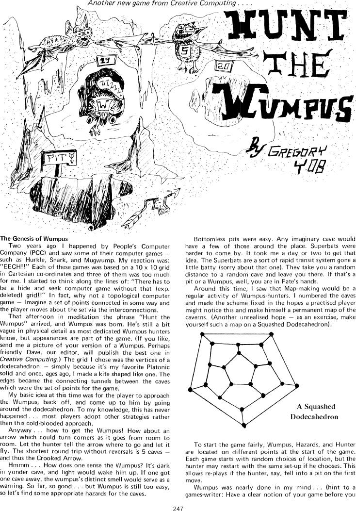
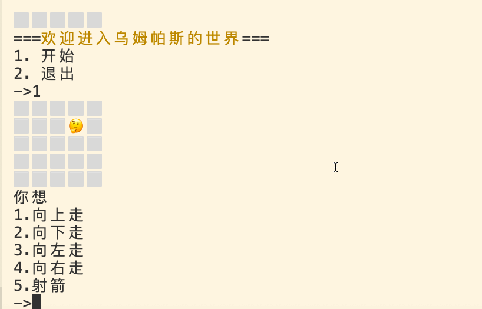
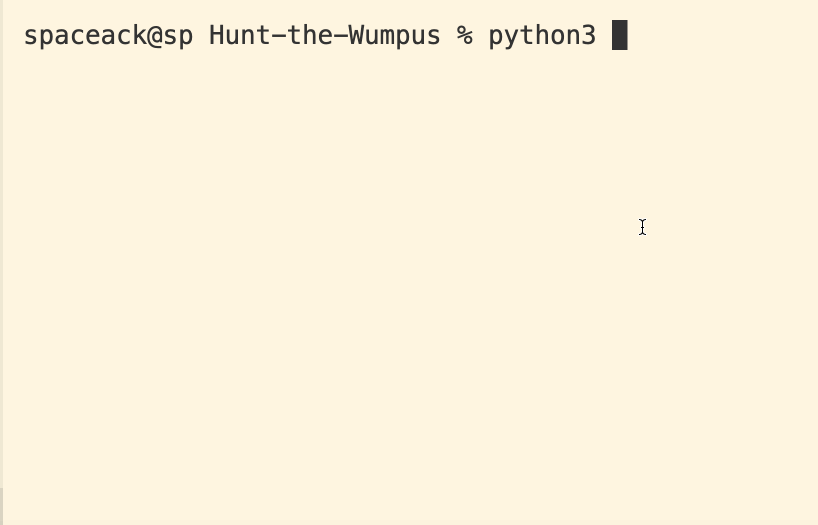
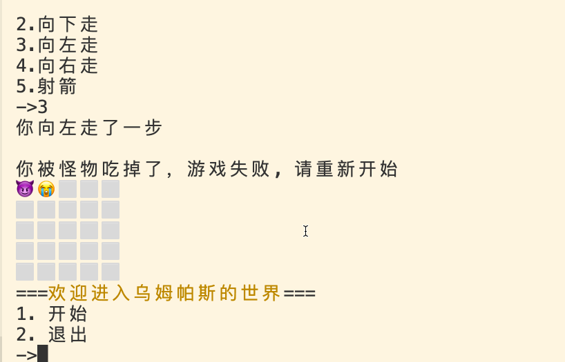
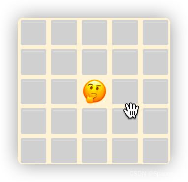
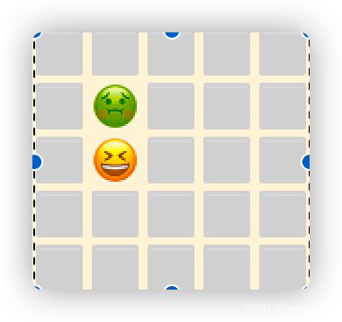
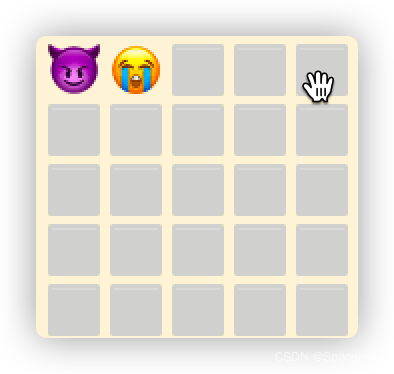

# 使用简单算法两小时实现猎杀乌姆帕斯（Hunt the Wumpus）Python小游戏

## “Hunt the Wumpus” 是什么？
引用wiki百科：
> Hunt the Wumpus是Gregory Yob于 1973 年开发的一款基于文本的
> 冒险游戏。在游戏中，玩家在一系列连接的洞穴中穿行，这些洞穴排列为十二面体的顶点，他们狩猎一个名叫 Wumpus
> 的怪物。
> 在回合制游戏中有玩家试图避免致命的无底洞和“超级蝙蝠”，将移动他们周围的洞穴系统; 目标是通过洞穴发射他们的“弯曲箭”之一以杀死Wumpus。



## 我们的目标
原著较为复杂，这里我们作出如下简化：
1. 原著十二面体可以展开为拥有20个顶点（洞穴）的地图。我们简化为更简单的 N*N 矩形地图。每个点代表一个洞穴。暂定为 5 x 5 共25个洞穴。
2. 每个洞穴（点）上下左右四通（非八达）🤪
3. 仅拥有一颗箭，即只有一次命中机会。如果错过未能将怪兽消灭即失败。
4. 如果不慎跌入怪兽洞也算失败。😏
5. 该地图不会出现 无底洞， 超级蝙蝠 等其它元素。😝
6. 隐藏信息，怪兽的洞穴是不可见的，当接近怪兽洞穴一个格子的距离时，会提示“你嗅到了乌姆帕斯的气息”。只有当胜利或失败时才显示。

## 成品展示
麻雀虽小，但五脏俱全呵！首先看一下最终实现的效果，多图杀猫～


**由于判断失误，直接进入怪物洞穴导致失败的情况：**



**由于只有一只箭，射箭方向错误导致怪物存活而失败的情况：**



**依靠聪明才智，成功战胜怪物，胜利的结局✌️**


## 关键技术
### 1.欢迎界面与开始菜单
这当然是最简单的部分啦，使用`字符串`输出`print`一段欢迎信息或游戏帮助信息。
然后接收用户的选择`input`,并根据不同的条件作出判断`if`
```python
def menu():
    print("===欢迎进入乌姆帕斯的世界===")
    ch = input("1. 开始\n2. 退出\n->")
    if ch == "1":
        begin()
    if ch == "2":
        print("好吧， 下次再见👋")

```

### 2. 地图的生成。
地图当然是最重要的一部分，实现的方式有很多种，这里使用最简单最容易理解的`列表嵌套`（二维数组）。
```python3
def create_map(x=5, y=5):
    # 生成地图
    yj = []
    for _ in range(y):
        xi = []
        for _ in range(x):
            xi.append(SPACE)
        yj.append(xi)
    wumpas_local, player_local = create_player_local(x, y)

    yj[wumpas_local[0]][wumpas_local[1]] = WUMPUS
    yj[player_local[0]][player_local[1]] = PLAYER
    global p_local
    p_local = [player_local[0], player_local[1]]
    return yj
```



玩家和怪物的`坐标`即`二维数组`的下标，使用随机数生成。这里可要**注意**咯！ 玩家和怪物的随机坐标可能会重合呦！避免随机数重复的方法由很多种，这里使用`递归算法`生成唯一的坐标。首先随机生成两个坐标，如果坐标相同则再次调用生成坐标的函数，直到生成两个不同的坐标。

```python
def random_local(x, y) -> tuple:
    """随机生成坐标"""
    return random.randint(0, x - 1), random.randint(0, y - 1)

def create_player_local(x, y) -> tuple:
    """生成怪物和玩家的唯一坐标
    wumpas_local 怪物坐标
    player_local 玩家坐标
    """
    wumpas_local = random_local(x, y)
    player_local = random_local(x, y)
    if wumpas_local == player_local:
        wumpas_local, player_local = create_player_local(x, y)
    if wumpas_local != player_local:
        return (wumpas_local, player_local)
```

### 3. 地图的显示
地图已经生成啦，显示就很简单啦！只需根据输赢的状态对地图的字符串做简单的替换即可。
1. **胜利的字符效果**


2. **失败的字符效果**

### 4. 位移，气息与射箭
玩家的位移，乌姆帕斯的气息与射箭逻辑都是相同的。本质就是对格子四个方向的坐标处理（气息需要处理周边八个格子）。

哈，只用到了二以内的加减法（加一，减一），简单吧？
啥？ 已经被整晕了？快拿个纸笔画一画～。
```python
def smell(x, y) -> bool:
    """判断附近是否有怪物"""
    x1 = MAP_X - 1 if p_local[0] == 0 else p_local[0] - 1
    x2 = 0 if p_local[0] == MAP_X - 1 else p_local[0] + 1
    y1 = MAP_Y - 1 if p_local[1] == 0 else p_local[1] - 1
    y2 = 0 if p_local[1] == MAP_Y - 1 else p_local[1] + 1

    round = [(x1, y), (x2, y), (x, y1), (x, y2), (x1, y1), (x1, y2), (x2, y1), (x2, y2)]

    for r in round:
        if MAP[r[0]][r[1]] == WUMPUS:
            return True
    return False
```

### 5. 大圆满
对啦，整个游戏其实就是一个状态机，总共有`胜利`，`失败` ，`游戏中`三种状态。那么我们可以使用一个 `while` 语句，搞起一个`事件循环` 。就可以一直愉快滴玩耍啦！开心不开心？

虽然该篇程序没有复杂的算法，但使用简单的`顺序`，`判断`，`循环` 语句和一丢丢`递归算法`就可实现稍稍复杂的小游戏。

正所谓：**大道至简  重剑无锋 大巧不工**

### 思考
这个游戏还有很多可以扩展的内容，下面留下几个思考题，让游戏更好玩吧～
1. 随机坐标去重还有哪些方式可以实现？
2. 加入 `无底洞`和 `超级蝙蝠` 元素。
3. 加入`游戏积分`，`游戏计时` 与 `游戏存档`功能。

---
源码见：
https://github.com/spaceack/Hunt-the-Wumpus.git
或关注公众号【编程之舞】回复wumpus领取。

