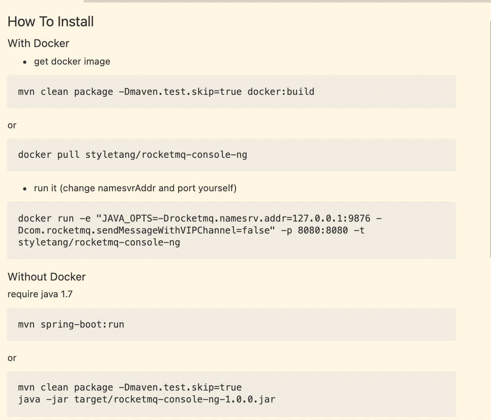

# RocketMQ笔记

[rocketmq](https://rocketmq.apache.org/)

[Apache RocketMQ开发者指南-官方](https://github.com/apache/rocketmq/tree/rocketmq-all-4.5.1/docs/cn)

[Apache RocketMQ开发者指南](https://www.itmuch.com/books/rocketmq/)

[rocketmq-externals](https://github.com/apache/rocketmq-externals.git)

## 安装运行
### 测试环境内存占用过大的问题

**现象**：
  内存负载高，甚至系统卡死，服务无法启动。

**解决方法**：

  修改文件`/rocketmq/bin/runbroker.sh`, 将 `#JAVA_OPT="${JAVA_OPT} -server -Xms8g -Xmx8g"` 改为 `JAVA_OPT="${JAVA_OPT} -server -Xms256m -Xmx256m`

  修改文件`/rocketmq/bin/runserver.sh`, 将 `JAVA_OPT="${JAVA_OPT} -server -Xms4g -Xmx4g -Xmn2g -XX:MetaspaceSize=128m -XX:MaxMetaspaceSize=320m"` 改为 `JAVA_OPT="${JAVA_OPT} -server -Xms256m -Xmx256m -Xmn128m -XX:MetaspaceSize=256m -XX:MaxMetaspaceSize=256m`

### 启动服务
  `cd /opt/rocketmq/bin`

1. 启动mqnamesrv `nohup sh mqnamesrv &`

2. 查看名字服务日志 `tail -f ~/logs/rocketmqlogs/namesrv.log`

3. 启动 broker 并允许自动创建topic `nohup sh mqbroker -n localhost:9876 autoCreateTopicEnable=true &`

4. 查看 broker 日志`tail -f ~/logs/rocketmqlogs/broker.log`

### 停止服务

1. 停止broker `sh mqshutdown broker`

2. 停止mqnamesrv `sh mqshutdown namesrv`

## 基础概念
### Message Model
**组成**
  1. `Producer` 生产消息
  2. `Consumer` 消费消息
  3. `Broker` 存储消息

- 每个`Broker` 存储多个`Topic`的消息
- 每个`Topic`的消息可分片存储于不同的·`Broker`
- `Message Queue` 存储消息的物理地址。
- 每个`Topic`中的消息地址存储于多个·`Message Queue`中。
- `ConsumerGroup` 由多个`Consumer`实例组成。

### 消息生产者 （Producer）
发送消息到`broker`,有多种发送方式：
1. 同步发送 (需要 Brocker ack）
2. 异步发送 (需要 Brocker ack）
3. 顺序发送
4. 单向发送

### 消息消费者 （Consumer）
消费消息，有多种消费方式：
1. 拉取式消费
2. 推动式消费 实时性较高。
### 主题（Topic）
表示一类消息的集合，消息订阅的基本单位。

### 消息（Message）
消息系统所传输信息的物理载体，生产和消费数据的最小单位，每条消息必须属于一个主题。RocketMQ中每个消息拥有唯一的Message ID，且可以携带具有业务标识的Key。系统提供了通过Message ID和Key查询消息的功能。

### 标签（Tag）
为消息设置的标志，用于同一主题下区分不同类型的消息。来自同一业务单元的消息，可以根据不同业务目的在同一主题下设置不同标签。标签能够有效地保持代码的清晰度和连贯性，并优化RocketMQ提供的查询系统。消费者可以根据Tag实现对不同子主题的不同消费逻辑，实现更好的扩展性。
### 名字服务（Name Server）
路由消息的提供者，生产者或消费者通过名字服务路由到指定的`Broker` IP列表。

### 拉取式消费（Pull Consumer）
消费者从`broker`拉取消息，消费者可以指定拉取消息的数量，消费者可以指定拉取消息的时间间隔？
### 推动式消费（Push Consumer）
`Broker` 收到数据后主动推送给消费端。实时性较高。
### 生产者组（Producer Group）
### 消费者组（Consumer Group）
### 集群消费（Clusetering）
集群消费模式下,相同 `Consumer Group`的每个`Consumer`实例平均分摊消息。
### 广播消费（Broadcasting）
广播消费模式下,每个`Consumer`实例都消费所有`Topic`的消息。
### 普通顺序消息（Normal Ordered Message）
普通顺序消费模式下，消费者通过同一个消息队列（ Topic 分区，称作 Message Queue） 收到的消息是有顺序的，不同消息队列收到的消息则可能是无顺序的。
### 严格顺序消息（Strictly Ordered Message）
严格顺序消息模式下，消费者收到的所有消息均是有顺序的。

## mqadmin 命令
### 查看所有消费者组
`./mqadmin consumerProgress -n 127.0.0.1:9876`

## GUI可视化管理控制台 rocketmq-console-ng

`git clone https://github.com/apache/rocketmq-externals.git` 

`git checkout origin/release-rocketmq-console-1.0.0`

具体安装方式可见`README.md`

`docker pull styletang/rocketmq-console-ng`

`sudo docker run -e "JAVA_OPTS=-Drocketmq.namesrv.addr=127.0.0.1:9876 -Dcom.rocketmq.sendMessageWithVIPChannel=false" -p 8080:8080 -t styletang/rocketmq-console-ng`

### 界面功能
#### 首页/Dashboard
- Broker Top 10
`broker`的消息总数 前10名条形排名图。

- Topic Top 10
每个`Topic`的消息总数 前10名条形排名图。

- Broker 5min trend

- Topic 5min trend

#### OPS
NameSvrAddrList
需要监控的 rocketmq 名字服务器地址列表。 可更新。

#### Cluster
可查看集群状态详情。配置详情。
broker 列表
  - broker 名称
  - 编号
  - 地址
  - 版本
  - 生产消息TPS
  - 消费消息TPS
  - 昨日/今日 生产总数
  - 昨日/今日 消费总数

#### Topic
- 新增/更新 Topic
  - clusterName 集群名
  - BROKER_NAME broker 名称
  - topicName Topic 名称
  - writeQueueNums 写队列数量
  - readQueueNums 读队列数量
  - perm 读写权限 （默认为6 可读可写 4 仅读 2 仅写）

- 查看Topic列表（NORMAL，RETRY，DLQ 死信队列筛选）
  - 状态
    - QUEUE
    - minOffset
    - maxOffset
    - lastUpdateTime
  - route
  - consumer manage
    - SubscriptionGroup
    - Delay
    - LastConsumeTime
    - Broker
    - Queue
    - conusmerClient
    - brokerOffeset
    - consumerOffset
    - diffTotal
    - lastTimeStamp
  - RESET CONSUMER OFFSET
  - DELETE
#### Consumer
显示订阅组 `SubscriptionGroup`状态。可以查看消费者是否成功订阅（在线）。
#### Producer

#### Message
这个最有用了，可以查看消息的详细信息。可根据 topic, 按照时间，MESSAGE_KEY或MESSAGE ID 查找小心。有没有消费？被谁消费了？很方便查询。
- Message ID
- Topic
- Tag
- key
- Storetime
- Message body
- message TrackList
  - consumerGroup
  - trackType (CONSUMED,UNCONSUMED,NOT_ONLINE)
  - RESEND MESSAGE
  _ VIEW EXCEPTION
