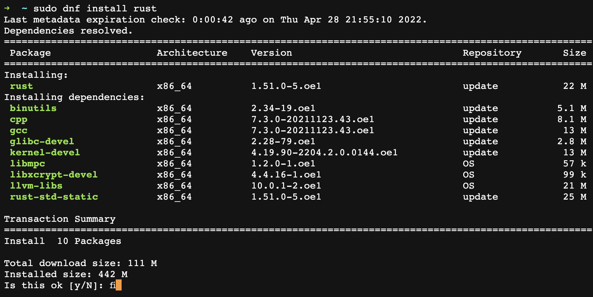
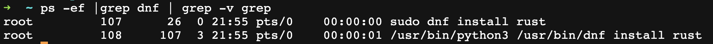
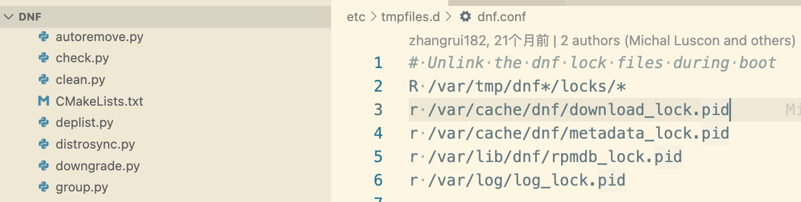

# 如何准确判断rpm,yum,dnf进程是否阻塞[运行]？

如果你是一个程序员，你会知道，`rpm`, `yum`, `dnf`这三个进程是否运行，如果运行，是否阻塞？

## 简单常用但不严谨的做法

一个简单方法是通过 `ps -ef | grep rpm | grep -v grep` 命令来判断。

但这种方法有两个问题：
1. 不严谨，当进程名中还有三个命令名字的某个子字符串时，就会误判。要不就是需要繁琐的规则去过滤，繁琐意味着引入更多的错误。

2. 仅能够判断有进程在运行，但并不一定会阻塞。例如当进行到用户确认这一步时，虽然有此进程，但依然可以再开个终端安装其它程序。

## 一种可行的做法的思考及验证过程

### 思考

这时我们可以思考，`rpm`,`yum`,`dnf`安装程序本身是如何保证进程互斥的呢？

不难发现，当我们同时开两个终端执行相同的安装命令时，会有一个终端报错`Waiting for process with pid 67 to finish.` 等待某个pid进程结束。

自然想到是某种锁机制在发挥作用，再联想到Linux的一切都可以是文件。那么这个`锁`也极有可能是个文件。

通过`搜索引擎`很容易发现·`yum`的 pid文件进程锁 的路径 `/var/run/yum.pid`。

### 验证

#### 验证程序
由于安装程序可能很快完成，来不及看到锁文件。所以我们可以快速实现一个简易的验证程序：

#### 山穷水尽疑无路

但很遗憾，并没有发现这个锁程序。

不过我们想到最新系统 `yum` 已被 `dnf` 所取代。那么可能网上都是一些过时的信息。

#### 柳暗花明又一村

这时最直接的方法当然是去撸源码咯！
`git clone https://github.com/rpm-software-management/dnf.git` 走起

通过`pid`关键字快速定位 `grep -inR pid`。

果然，很容易验证了我们正确的猜想

#### 再次验证

#### rpm 的检验

`fuser /var/lib/rpm/.rpm.lock`

