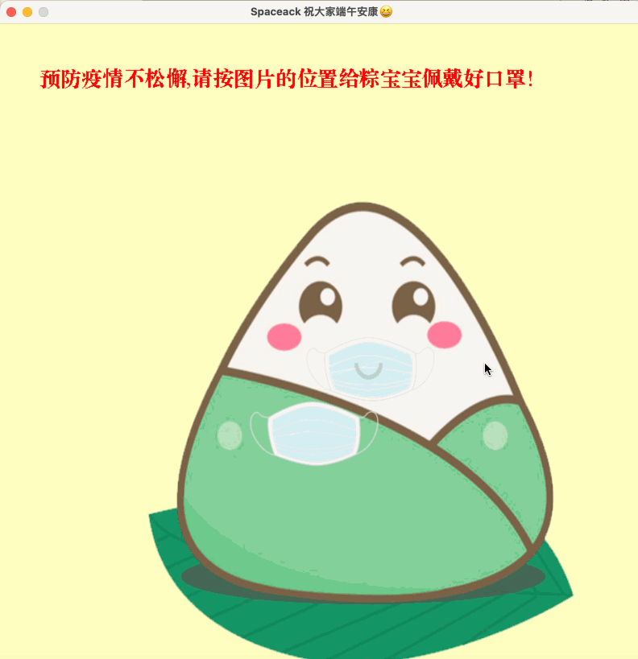
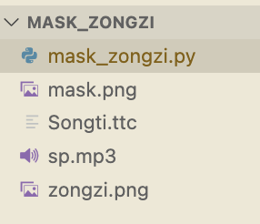
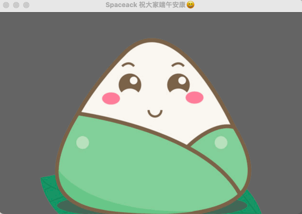
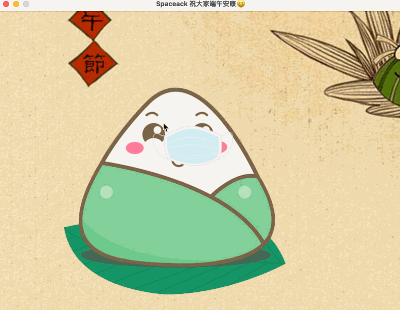

# 端午抗疫宣传公益小游戏-用Python为粽子宝宝戴口罩

## 缘起

由于新冠疫情影响，为避免户外威胁，我选择了居家以程序员的方式纪念这个端午。

虽然气温较高，疫情也得到了有效的控制，但为了他人和自身的身体健康，仍然需要在人流密集的公共场所佩戴好口罩😷。

由此，我以**为粽子宝宝戴口罩**😷为主题，花费4个小时（构思，素材收集，编码, 记录），制作了一个公益小游戏。科普防疫戴口罩。纪念这个端午！

## 目标

1. 此游戏使用Python语言，并使用Pygame游戏开发库进行制作。
2. 游戏开始会有一个未戴口罩的粽子宝宝的形象。
3. 粽子宝宝的口鼻处有个半透明的口罩，这个是提示我们应该戴口罩的位置。
4. 玩家控制键盘的方向键，移动口罩。
5. 当口罩移动到预定位置，游戏成功通关，画面出现成功通关提示！

## 成品展示

麻雀虽小，但五脏俱全呵！首先看一下最终实现的效果，一图杀猫～



此处有背景音乐🎵～

## 关键技术

首先安装`pygame`游戏库 `pip install pygame`

### 素材及目录结构

仅有五个文件，包括两张图片素材，一个音乐素材，一个字体素材及源码文件。源码及素材见文末


### 游戏对象初始化

使用Pygame框架首先要初始化pygame对象。

```python
def init_game(caption):
    # 初始化pygame
    pygame.init()
    # 变量定义
    size = width, height = 800, 800
    # 创建一个游戏窗口
    screen = pygame.display.set_mode(size, 0, 32)
    #设置窗口标题
    pygame.display.set_caption(caption)
    return screen
```

### 背景音乐

我们可以使用`load`载入需要播放的音乐文件。
`play`方法的第一个参数`loops`和第二个参数`start`分别代表重复的次数和开始播放的位置。`-1`就是循环播放。

```python
def play_music():
    pygame.mixer.music.load('sp.mp3')
    pygame.mixer.music.play(-1, 0.0)
```

### 渲染图片

1. 加载图片对象

```python
zongzi = pygame.image.load("zongzi.png")
```

2. 平滑缩放图像，可以控制图片的大小。

```python
zongzi = pygame.transform.smoothscale(zongzi, (500, 700))
```

3. 图片透明度设置

```python
mask.set_alpha(200)
```

4. 渲染图片

```python
screen.blit(zongzi,(200,200))
```

### 文字渲染

1. 通过字体文件获得字体对象

```python
fontObj = pygame.font.Font('Songti.ttc', 26) 
```

2. 配置要显示的文字

可以设置文字的内容及字体颜色。

```python
textSurfaceObj = fontObj.render('你真棒，粽宝宝已成功佩戴好口罩！', False, (255,10,10))
```

### 键盘控制

使用 `pygame.KEYDOWN` 获取键盘事件。
`K_UP`,`K_DOWN`,`K_LEFT`,`K_RIGHT` 分别对应键盘方向键`上下左右`
通过坐标的加减，来改变坐标的位置，这里以`10`为按键一次的移动距离。

```python
if event.type == pygame.KEYDOWN:
    if event.key == pygame.K_UP:
        mask_y -= 10
    if event.key == pygame.K_DOWN:
        mask_y += 10
    if event.key == pygame.K_LEFT:
        mask_x -= 10
    if event.key == pygame.K_RIGHT:
        mask_x += 10
```

## 思考
对啦，整个游戏其实就是一个状态机，总共有开始，胜利 ，游戏中三种状态。那么我们可以使用一个 while 语句，搞起一个事件循环 。就可以一直愉快滴玩耍啦！开心不开心？

虽然该篇程序没有复杂的算法，但使用简单的顺序，判断，循环 语句就可实现稍稍复杂的小游戏。

正所谓：大道至简 重剑无锋 大巧不工

这个游戏还有很多可以扩展的内容，下面留下几个思考题，让游戏更好玩吧～

1. 增加游戏难度，如何让粽子宝宝随机移动，一边移动一边尝试戴口罩？[已实现]


2. 使用鼠标控制口罩。[已实现]
原理：实时获取鼠标光标的坐标，将图片的坐标与鼠标光标的相对位置绑定即可

```python
# 获取光标位置
x, y = pygame.mouse.get_pos()
```


3. 加入计时及显示功能。

---
源码见： `https://github.com/spaceack/spaceack_games/tree/main/mask_zongzi` 或关注公众号【编程之舞】回复`maskzongzi`领取。

