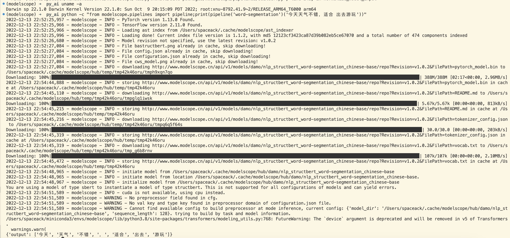
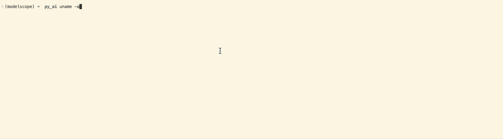

# Mac M1 安装 modelscope 深度学习库

## 简介

随着社区支持的不断完善，现已支持M1 MAC 版本的 ModelScope安装。

[modelscope官网](https://modelscope.cn/)，ModelScope 社区成立于 2022 年 6 月，是一个模型开源社区及创新平台，由阿里巴巴达摩院，联合 CCF开源发展委员会，共同作为项目发起方。社区联合国内 AI 领域合作伙伴与高校机构，致力于通过开放的社区合作，构建深度学习相关的模型开源，并开源相关模型服务创新技术，推动模型应用生态的繁荣发展。

## 基础环境

以 Mac M1 安装为例，以下是我的安装环境。

```bash
Darwin sp 22.1.0 Darwin Kernel Version 22.1.0: Sun Oct  9 20:15:09 PDT 2022; root:xnu-8792.41.9~2/RELEASE_ARM64_T6000 arm64
```

## 安装

### 1. 安装 M1 Mac Anaconda

根据 [pytorch官网](https://pytorch.org/get-started/locally/) 指南安装 Anaconda

```bash
# The version of Anaconda may be different depending on when you are installing`
curl -O https://repo.anaconda.com/miniconda/Miniconda3-latest-MacOSX-arm64.sh
sh Miniconda3-latest-MacOSX-arm64.sh
# and follow the prompts. The defaults are generally good.`
```

### 2. 创建conda modelscope环境

虽然目前 modelscope官网建议使用 python3.7+。
但是由于python3.7 和 python3.9可能有问题，这里选用python3.8,

```bash
conda install setuptools_scm
conda create -n modelscope python=3.8
conda activate modelscope
```

### 3. 安装 M1 Mac  Pytorch

在 modelscope 环境下执行：

```bash
pip3 install torch torchvision torchaudio
```

### 4. 安装 M1 Mac tensorflow

由于 ModelScope同时支持 Pytorch 和 tensorflow。
若安装官网直接进行第5步，会自动把这两个依赖装上。但在编译 `grpcio` 这个依赖库时会提示编译错误。
由 [Grpcio fails installation for Tensorflow 2.5 on arm64 Apple Silicon](https://stackoverflow.com/questions/69151553/grpcio-fails-installation-for-tensorflow-2-5-on-arm64-apple-silicon)得知安装M1 Mac tensorflow方法。

在 modelscope 环境下执行：

```bash
GRPC_PYTHON_BUILD_SYSTEM_OPENSSL=1 GRPC_PYTHON_BUILD_SYSTEM_ZLIB=1  python -m pip install tensorflow-macos
```

### 5. 安装 M1 Mac modelscope

在 modelscope 环境下执行：

```bash
pip install "modelscope[cv,nlp,multi-modal,science]" -f https://modelscope.oss-cn-beijing.aliyuncs.com/releases/repo.html
```

由于对 audio不感兴趣，未测试 modelscope `audio`的安装。

## 安装验证

```bash
python -c "from modelscope.pipelines import pipeline;print(pipeline('word-segmentation')('今天天气不错，适合 出去游玩'))"
```





