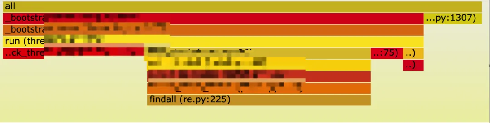
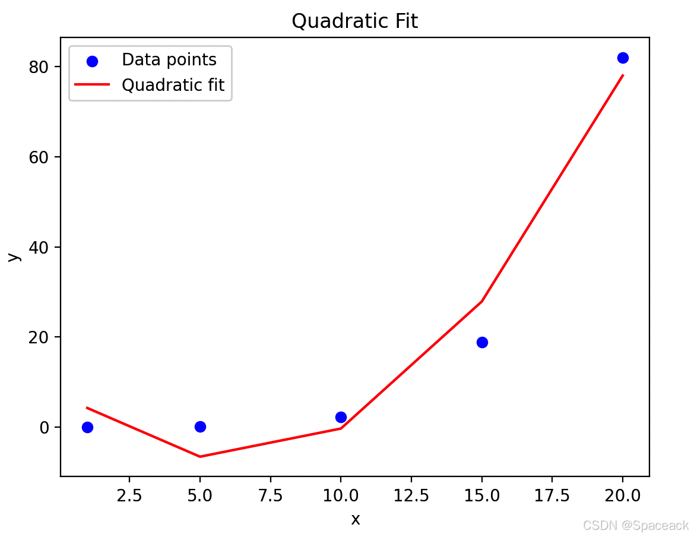

# RAC-Python进程假死根本原因分析

## 问题现象
- 一个Python进行执行特定操作时，CPU占用100%。有阻塞情况发生，无法处理其它任务。服务状态是正常的。服务进程并没有崩溃。
## 分析原因
### 问题定位
- 由于服务日志与系统日志没有报任何错误信息，给问题排查定位带来了一定的阻碍。
- 因此，借助Python 程序的采样分析器`py-spy`来帮助我们排查问题，`py-spy`主要使用`Rust`语言编写。开销低，使用另外的进程对Python程序监控，无需`插桩`等改动代码， 绿色无污染，可以安全的对生产代码作监控。通过生成的`火焰图`可知，程序阻塞在一个`re`的正则函数上。

### 正则分析
- 正则表达式的复杂度通常取决于其模式的长度和复杂性。当正则表达式包含多个`非贪婪匹配`和通配符，这通常会导致回溯（backtracking），尤其是在匹配失败时。回溯会增加正则表达式的执行时间，尤其是在输入文本较长的情况下。
- 正则表达式的执行时间通常与输入文本的长度成正比。对于一个长度为 `n` 的输入文本，最坏情况下，正则表达式的复杂度可能是 `O(n^2)`，尤其是在存在大量回溯的情况下。
- 如果输入文本较短，且正则表达式的匹配路径较为简单，复杂度可能接近 `O(n)`。如果输入文本较长，且正则表达式包含多个非贪婪匹配和通配符，复杂度可能接近 `O(n^2)`。
### 测试验证
- 分别观测数据规模为1，5，10，15，20 的正则处理的时间
-  得到时间消耗分别为0.05s, 0.11s,  2,29s,18.89s,  81.97s
-  直观感觉这是一个指数级别的增涨。为了更加直观观测，可以使用二次拟合（抛物线法）做个拟合图。

- 从拟合图可直观观测到， 前两个点增长较为平缓， 从第三个点开始，斜率徒增。以下是拟合代码。
```python3
import numpy as np
import matplotlib.pyplot as plt

# 给定的数据
x = np.array([1, 5, 10, 15, 20])
y = np.array([0.05, 0.11, 2.29, 18.89, 81.97])

# 计算二次多项式拟合的系数
coefficients = np.polyfit(x, y, 2)
a, b, c = coefficients

# 生成拟合曲线上的点
fit_curve = a * x**2 + b * x + c

# 绘制原始数据点和拟合曲线
plt.scatter(x, y, color='blue', label='Data points')
plt.plot(x, fit_curve, color='red', label='Quadratic fit')

# 添加图例和标签
plt.legend()
plt.xlabel('x')
plt.ylabel('y')
plt.title('Quadratic Fit')

# 显示图形
plt.show()

```
- 问题得到了定位与验证，是由于一个正则解析不合理导致。
## 解决方案
- 对文本进行分段匹配，避免一次性匹配整个文本。
## 经验总结
1. 对正则的处理一定要格外小心，尽量使用复杂度低的正则解析。若有复杂的解析表达式，尽可能对其拆分，分段处理。
2. 需要对正则表达式进行测试，尤其是不同量级规模的文本。增加对文本规模的限制。
3. 灵活运用`py-spy`等性能分析工具，提升排查问题效率
---
最后分享一段关于正则的笑话：
> 有些人在碰到问题时，就想：“我知道，我可以使用正则表达式。”现在，他们就有了两个问题。 —Jamie“jwz” Zawinski， 1997 年8 月
---
