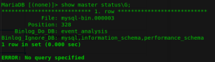
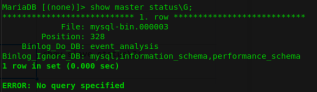
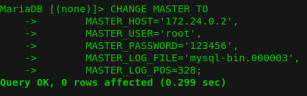
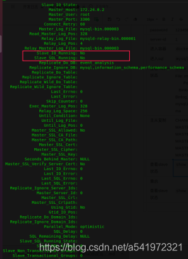
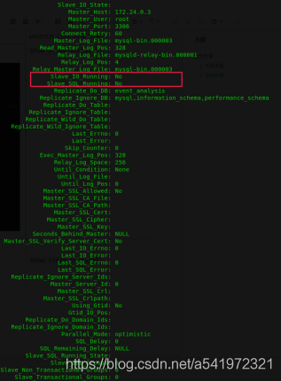
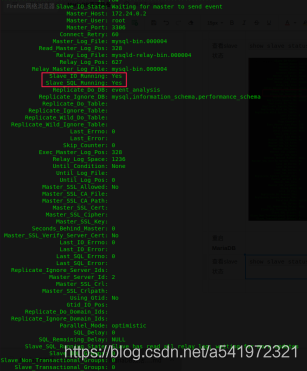
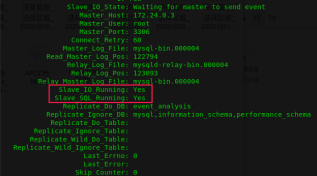

## MariaDB双主模式测试
### 1. 环境准备
创建目录 `mkdir conf conf2 data data2 log log2 `
创建 **MariaDB** 配置文件 `touch conf/my.cnf conf2/my.cnf `
**conf/my.cnf文件**
```bash
# The MariaDB configuration file
#
# The MariaDB/MySQL tools read configuration files in the following order:
# 0. "/etc/mysql/my.cnf" symlinks to this file, reason why all the rest is read.
# 1. "/etc/mysql/mariadb.cnf" (this file) to set global defaults,
# 2. "/etc/mysql/conf.d/*.cnf" to set global options.
# 3. "/etc/mysql/mariadb.conf.d/*.cnf" to set MariaDB-only options.
# 4. "~/.my.cnf" to set user-specific options.
#
# If the same option is defined multiple times, the last one will apply.
#
# One can use all long options that the program supports.
# Run program with --help to get a list of available options and with
# --print-defaults to see which it would actually understand and use.
#
# If you are new to MariaDB, check out https://mariadb.com/kb/en/basic-mariadb-articles/

#
# This group is read both by the client and the server
# use it for options that affect everything
#
[client-server]
# Port or socket location where to connect
# port = 3306
socket = /run/mysqld/mysqld.sock

# Import all .cnf files from configuration directory
!includedir /etc/mysql/conf.d/
!includedir /etc/mysql/mariadb.conf.d/
[mysqld]
server-id=1
log-bin=mysql-bin
binlog_format = mixed
binlog-do-db=event_analysis 
binlog-ignore-db =mysql
binlog-ignore-db =information_schema
binlog-ignore-db =performance_schema

replicate-do-db=event_analysis
replicate-ignore-db=mysql
replicate-ignore-db=information_schema
replicate-ignore-db=performance_schema
read-only=0

relay_log=mysqld-relay-bin
log-slave-updates=ON
auto-increment-increment = 2
auto-increment-offset = 1
```
**conf/my.cnf文件**
```bash
# The MariaDB configuration file
#
# The MariaDB/MySQL tools read configuration files in the following order:
# 0. "/etc/mysql/my.cnf" symlinks to this file, reason why all the rest is read.
# 1. "/etc/mysql/mariadb.cnf" (this file) to set global defaults,
# 2. "/etc/mysql/conf.d/*.cnf" to set global options.
# 3. "/etc/mysql/mariadb.conf.d/*.cnf" to set MariaDB-only options.
# 4. "~/.my.cnf" to set user-specific options.
#
# If the same option is defined multiple times, the last one will apply.
#
# One can use all long options that the program supports.
# Run program with --help to get a list of available options and with
# --print-defaults to see which it would actually understand and use.
#
# If you are new to MariaDB, check out https://mariadb.com/kb/en/basic-mariadb-articles/

#
# This group is read both by the client and the server
# use it for options that affect everything
#
[client-server]
# Port or socket location where to connect
# port = 3306
socket = /run/mysqld/mysqld.sock

# Import all .cnf files from configuration directory
!includedir /etc/mysql/conf.d/
!includedir /etc/mysql/mariadb.conf.d/
[mysqld]
server-id=2
log-bin=mysql-bin
binlog_format = mixed
binlog-do-db=event_analysis 
binlog-ignore-db =mysql
binlog-ignore-db =information_schema
binlog-ignore-db =performance_schema

replicate-do-db=event_analysis
replicate-ignore-db=mysql
replicate-ignore-db=information_schema
replicate-ignore-db=performance_schema
read-only=0

relay_log=mysqld-relay-bin
log-slave-updates=ON
auto-increment-increment = 2
auto-increment-offset = 1
```
使用  **docker** 启动两个 **MariaDB** 容器 **bak1** 和 **bak2** 。使用 docker-compose up 启动容器。
```yaml
version: '2'
services:
  "mariadb":
    image: mariadb:10.5.5
    container_name: "bak1"
    restart: always
    environment:
      MYSQL_USER: "root"
      MYSQL_PASSWORD: "123456"
      MYSQL_ROOT_PASSWORD: "123456"
      TZ: "Asia/Shanghai"
    ports:
      - "3307:3306"
    volumes:
      - ./data:/var/lib/mysql
      - ./log:/var/log/mysql
      - ./conf/my.cnf:/etc/mysql/my.cnf
    networks:
      mysql_bak_net:
  "mariadb2":
    image: mariadb:10.5.5
    container_name: "bak2"
    restart: always
    environment:
      MYSQL_USER: "root"
      MYSQL_PASSWORD: "123456"
      MYSQL_ROOT_PASSWORD: "123456"
      TZ: "Asia/Shanghai"
    ports:
      - "3308:3306"
    volumes:
      - ./data2:/var/lib/mysql
      - ./log2:/var/log/mysql
      - ./conf2/my.cnf:/etc/mysql/my.cnf
    networks:
      mysql_bak_net:
networks:
  mysql_bak_net:
```
## 2. 操作步骤

| 容器名 |bak1  |bak2|
|--|--|--|
|ip  |172.24.0.3  |172.24.0.2|
| user | root | root |
| password | 123456 | 123456 |
| server-id | 1 | 2 |
| 进入容器 | `docker exec -it bak1 bash`  | `docker exec -it bak2 bash`  |
| 进入sql | `mysql -u root -p`  | `mysql -u root -p`  |
| 查看master状态 | `show master status\G;` <br> File: mysql-bin.000003<br> Position: 328<br>Binlog_Do_DB: event_analysis<br>Binlog_Ignore_DB: mysql,information_schema,performance_schema<br>|`show master status\G;`  <br> File: mysql-bin.000003<br>Position: 328<br> Binlog_Do_DB: event_analysis<br> Binlog_Ignore_DB: mysql,information_schema,performance_schema<br>
|主从复制|CHANGE MASTER TO<br>MASTER_HOST='172.24.0.2', <br>MASTER_USER='root', <br>MASTER_PASSWORD='123456', <br>MASTER_LOG_FILE='mysql-bin.000003', <br>MASTER_LOG_POS=328;|CHANGE MASTER TO<br>MASTER_HOST='172.24.0.3', <br>MASTER_USER='root', <br>MASTER_PASSWORD='123456', <br>MASTER_LOG_FILE='mysql-bin.000003', <br>MASTER_LOG_POS=328;|
|查看slave状态|`show slave status\G;`<br>|`show slave status\G;`<br>|
|重启**MariaDB**|||
|查看slave状态|`show slave status\G;`<br>|`show slave status\G;`<br> |
| 验证 | 在bak1中创建表，更新数据，bak2也会更新。 | 在bak2中创建表，更新数据，bak1也会更新。 |
