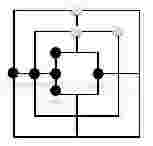

#### 问题:

- 阿里九游开放平台近日上架了一款新的益智类游戏——成三棋。成三棋是我国非常古老的一个双人棋类游戏.
- 成三棋的棋盘上有很多条线段，只能在线段交叉点上放入棋子。我们可以用坐标系来描述棋盘.
- 如果一条线段上的三个交叉点都被同一玩家的棋子占据的话，则称这条线段被该玩家 成三。现在，小红和小明两人在游戏平台上下棋，其中小红的棋子是黑色的。请你帮小红计算他成三的线段数。
- 样例对应的棋盘如下：

##### 输入
- 输入第一行两个整数 \(n,m(3 \le n, m \le 9)\)，n表示小红的棋子数，m表示小明的棋子数。
- 接下来 n行输入小红的棋子坐标。
- 接下来 m行输入小明的棋子坐标。
- 输入保证坐标合法，并且棋子之间不重合。
```
6 3
-1 0
-2 0
-3 0
-1 -1
-1 1
1 0
0 2
0 3
2 2
```
##### 样例输出
```
# 输出小红成三的线段数。
2
```

##### 题解
- 按一定规则对成三棋盘进行扫描，应避免某些坐标点漏扫或重复扫描．
```python
x ,y = [int(x) for x in str(input()).split()]
R = []
for m in range(x):
    mx,my = [int(x) for x in str(input()).split()]
    R.append(tuple((mx,my)))

num = 0

for x in range(-3,4):
    if len(set(R) & set([(x,0)])) > 0:
        # 正方形竖边
        if (x,x) in R and (x,-x) in R:
            num += 1
        # X正半轴
        if x==2 and (x+1,0) in R and (x-1,0) in R:
            num += 1
        # X负半轴
        if x==-2 and (x+1,0) in R and (x-1,0) in R:
            num += 1

    if len(set(R) & set([(0,x)])) > 0:
        # 正方形横边
        if (x,x) in R and (-x,x) in R:
            num += 1
        # Y正半轴
        if x == 2 and (0, x+1) in R and (0, x-1) in R:
            num += 1
        # Y负半轴
        if x == -2 and (0, x+1) in R and (0, x-1) in R:
            num += 1

print(num)
```