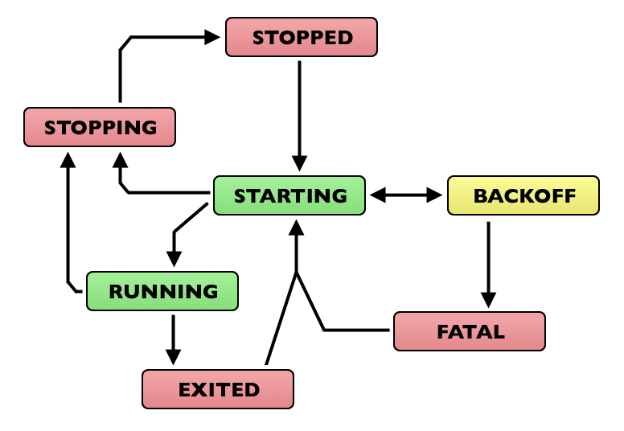

[Supervisor Docs](http://www.supervisord.org/)

使用ssh远程维护VPS时候，要在后台挂起一个程序。挂起程序很简单，在command后加上**&**符号就可以，但是当断开ssh时候，挂起的程序也随之killed, 很是恼火。在使用**nohup** 的时候意外发现了**supervisor**, **supervisor**使用python开发，通过配置文件来配置需要启动监管的程序，作为```supervisord```的子进程。执行程序**supervisord**即‘守护进程’（Daemon）[在希腊神话中是守护神的意思！类似中国的护法？**daemon**这个词和恶魔(demon)只差一个字母，且发音完全一样！多的a这个品质可理解为全神关注的(absorbed)/精确的(accurate)/能干的(able)/乐于助人的(accommodating)/友好的(amicable)]。类似**httpd**, **mysqld**最后的d字母意为守护程序。

---
### 安装
easy_install supervisor
or 
pip3 install supervisor
or
sudo apt install supervisor
### 配置
执行命令```echo_supervisord_conf```回显默认的初始配置文件。
可通过管道命令将配置文件重定向到某个目录，eg:```echo_supervisord_conf > /etc/supervisord.conf```
以root用户运行需要增加 `user=root`
#### 配置进程
例如要在vps上启用一个简单的http服务，用于分享download目录下的文件
```
[program:http-server]
command=python3 -m http.server
directory=/home/download/
redirect_stderr = true
user=root
autostart=true
autorestart=true
stderr_logfile=/var/log/simple-http-server_err.log
stdout_logfile=/var/log/simple-http-server_out.log
```
#### 启用web监控服务
通过浏览器远程管理，启动停止程序，查看日志等，非常方便。
```
[inet_http_server]         ; inet (TCP) server disabled by default
port=0.0.0.0:9001        ; (ip_address:port specifier, *:port for all iface)
username=user              ; (default is no username (open server))
password=123               ; (default is no password (open server))

```
### 启动 supervisor
```supervisord -c supervisor.conf```

### supervisorctl
- 当配置文件更新后, 可用```supervisorctl update```更新配置, 但并未立即生效,需重启.
- 一般使用```supervisorctl reload```更新配置并重启所有程序.
- 停止所有程序 ```supervisorctl stop all```
- 启动/停止/重启某程序 ```supervisorctl {start:stop:restart} program_name```
- 查看所有子进程的状态```supervisorctl```
### 子进程状态

七种状态

- STOPPED
- STARTING
- RUNNING
- BACKOFF
- STOPPING
- EXITED

第八种**UNKNOWN**(由supervisord出错引起)

