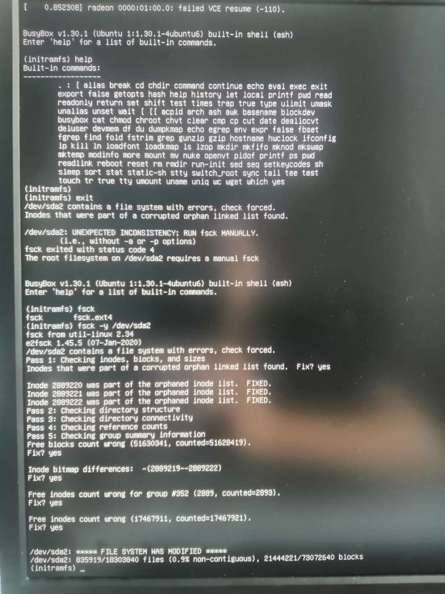
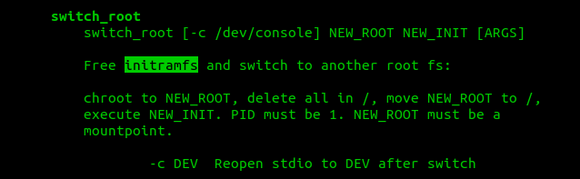

## 问题现象
今天遇到一个奇怪的问题：

非正常重启后，或热插拔主板接口设备？。导致鼠标，键盘失去响应，重新插拔USB接口后，鼠标键盘电源灯无法点亮，屏幕无响应。再次重启后出现黑屏，提示错误如下：

```
 initramfs unpacking failed decoding failed
 radeon 0000:01:00.0: failed VCE resume (-110).
```


大意就是 `/dev/sda2`分区包含一个文件系统错误，（inodes）在被损坏的孤立的节点表中。
要用`fsck`这个命令修复。

按照提示，使用命令修复即可: `fsck -y /dev/sda2`

### BusyBox
幸运的是，出错后自动进入到`BusyBox`环境。`BusyBox`是什么呢？ 经过一通`man busybox`猛如虎的操作后，发现`BusyBox`是一个集合多种工具命令的工具箱，又或称嵌入式Linux系统的瑞士军刀。可用作急救盘。


### initramfs
`initramfs (initram file system)` 用于挂载根文件系统。initramfs是在普通根文件系统上可以找到的完整目录集, 在启动时，引导加载程序会把内核和`initramfs`镜像加载到内存并启动内核。 `initramfs`可以在启动早期提供一个用户态环境。

### initramfs 与 BusyBox 是什么关系？
我理解`initramfs`就是一种文件系统。`BusyBox`是命令工具集，其中还有一个`switch_root`命令,可以切换root文件系统。


### fsck
fsck（file system check）用来检查和维护不一致的文件系统。若系统掉电或磁盘发生问题，可利用fsck命令对文件系统进行检查。