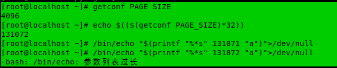

对于 Linux bash 参数过长错误 “Argument list too long” 网上有很多解决方案，但并没有解释这个最大长度的值的范围。本着追根溯源的态度，本文对此问题做一个探究。记录下限制参数长度的因素以及最大长度。

## 参数最大长度
如何确认Linux bash中能接受的最大长度呢？
>Number of arguments and maximum length of one argument
At least on Linux 2.6, there's also a limit on the maximum number of arguments in argv[].
On Linux 2.6.14 the function do_execve() in fs/exec.c tests if the number exceeds
  PAGE_SIZE*MAX_ARG_PAGES-sizeof(void *) / sizeof(void *)
On a 32-bit Linux, this is ARGMAX/4-1 (32767). This becomes relevant if the average length of arguments is smaller than 4.
Since Linux 2.6.23, this function tests if the number exceeds MAX_ARG_STRINGS in <linux/binfmts.h> (2^32-1 = 4294967296-1).
And as additional limit since 2.6.23, one argument must not be longer than MAX_ARG_STRLEN (131072).
This might become relevant if you generate a long call like "sh -c 'automatically generated with many arguments'".
(pointed out by Xan Lopez and Ralf Wildenhues)

参考[ARG_MAX, maximum length of arguments for a new process](https://www.in-ulm.de/~mascheck/various/argmax/)
从以上文献中能看出在Linux2.6.23内核以后参数长度最长不能超过`MAX_ARG_STRLEN`

`MAX_ARG_STRLEN`在`<linux/binfmts.h>`中定义为:

> #define MAX_ARG_STRLEN (PAGE_SIZE * 32)

## 验证
如下图验证所示：
可以通过`getconf PAGE_SIZE` 获取内存页大小。
```bash
# 获取内存页大小
(base) [root@localhost ~]# getconf PAGE_SIZE
4096
```
通过`echo $(( $(getconf PAGE_SIZE)*32 )) `得到 `MAX_ARG_STRLEN`值，




```bash
(base) [root@localhost ~]# echo $(($(getconf PAGE_SIZE)*32))
131072
```

```bash
# 131072 字节的参数列表，报错
(base) [root@localhost ~]# /bin/echo "$(printf "%*s" 131072 "a")">/dev/null
-bash: /bin/echo: Argument list too long
# 131071 字节的参数列表，没有问题
(base) [root@localhost ~]# /bin/echo "$(printf "%*s" 131071 "a")">/dev/null
```
131071 字节是参数列表的最大支持长度, 结果符合我们的预测。