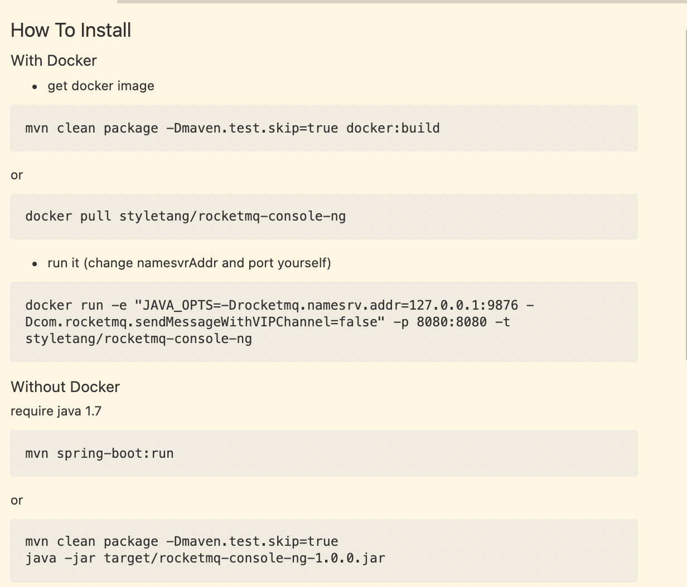

[rocketmq](https://rocketmq.apache.org/)

[Apache RocketMQ开发者指南-官方](https://github.com/apache/rocketmq/tree/rocketmq-all-4.5.1/docs/cn)

[Apache RocketMQ开发者指南](https://www.itmuch.com/books/rocketmq/)

[rocketmq-externals](https://github.com/apache/rocketmq-externals.git)

## 安装运行
### 测试环境内存占用过大的问题

  现象：内存负载高，甚至系统卡死，服务无法启动。

  解决方法：

    修改文件`/rocketmq/bin/runbroker.sh`, 将 `#JAVA_OPT="${JAVA_OPT} -server -Xms8g -Xmx8g"` 改为 `JAVA_OPT="${JAVA_OPT} -server -Xms256m -Xmx256m`

    修改文件`/rocketmq/bin/runserver.sh`, 将 `JAVA_OPT="${JAVA_OPT} -server -Xms4g -Xmx4g -Xmn2g -XX:MetaspaceSize=128m -XX:MaxMetaspaceSize=320m"` 改为 `JAVA_OPT="${JAVA_OPT} -server -Xms256m -Xmx256m -Xmn128m -XX:MetaspaceSize=256m -XX:MaxMetaspaceSize=256m`

### 启动服务
  `cd /opt/rocketmq/bin`

1. 启动mqnamesrv `nohup sh mqnamesrv &`

2. 查看名字服务日志 `tail -f ~/logs/rocketmqlogs/namesrv.log`

3. 启动 broker 并允许自动创建topic `nohup sh mqbroker -n localhost:9876 autoCreateTopicEnable=true &`

4. 查看 broker 日志`tail -f ~/logs/rocketmqlogs/broker.log`

### 停止服务

1. 停止broker `sh mqshutdown broker`

2. 停止mqnamesrv `sh mqshutdown namesrv`

## mqadmin 命令
### 查看所有消费者组

`./mqadmin consumerProgress -n 127.0.0.1:9876`

## 基础

`Producer` 生产消息
`Consumer` 消费消息
`Broker` 存储消息

## GUI可视化管理控制台 rocketmq-console-ng

`git clone https://github.com/apache/rocketmq-externals.git` 

`git checkout origin/release-rocketmq-console-1.0.0`

具体安装方式可见`README.md`

`docker pull styletang/rocketmq-console-ng`

`sudo docker run -e "JAVA_OPTS=-Drocketmq.namesrv.addr=127.0.0.1:9876 -Dcom.rocketmq.sendMessageWithVIPChannel=false" -p 8080:8080 -t styletang/rocketmq-console-ng`