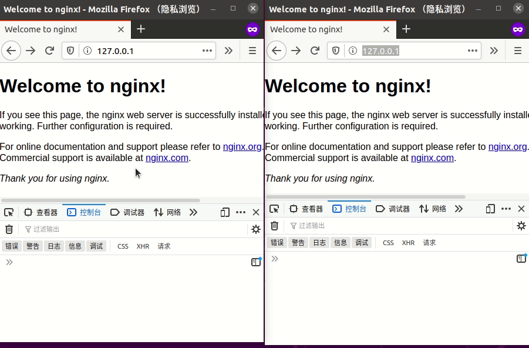

## 介绍
服务器推送事件： Server-Sent Events, [SSE](https://html.spec.whatwg.org/multipage/server-sent-events.html)

### 特点
1. 仅从服务器向客户端实现单向实时通信。
2. 实现简单，基于HTTP协议。
3. 浏览器端有断线重连功能。
4. 支持用户自定义消息类型。
5. 用来传送文本， 二进制需要编码。

## flask-sse 实现
[flask-sse文档](https://flask-sse.readthedocs.io/)
### 前置条件
1. 本地Redis服务器
2. gunicorn gevent, sse是无限事件流，flask处理HTTP请求一次只能响应一个，要需要配合异步服务器使用。

### 实现
**服务端** sse.py
```python
from flask import Flask, render_template
from flask_sse import sse

app = Flask(__name__)
app.config["REDIS_URL"] = "redis://localhost"
app.register_blueprint(sse, url_prefix='/stream')

@app.route('/')
def index():
    return render_template("index.html")

@app.route('/hello')
def publish_hello():
    sse.publish({"message": "Hello!"}, type='greeting')
    return "Message sent!"
```

**客户端**
templates/index.html
```html
<!DOCTYPE html>
<html>
<head>
  <title>Flask-SSE Quickstart</title>
</head>
<body>
  <h1>Flask-SSE Quickstart</h1>
  <script>
    var source = new EventSource("{{ url_for('sse.stream') }}");
    source.addEventListener('greeting', function(event) {
        var data = JSON.parse(event.data);
        console.log("The server says " + data.message);
    }, false);
    source.addEventListener('error', function(event) {
        console.log("Failed to connect to event stream. Is Redis running?");
    }, false);
  </script>
</body>
</html>
```

```gunicorn sse:app --worker-class gevent --bind 127.0.0.1:8000```

