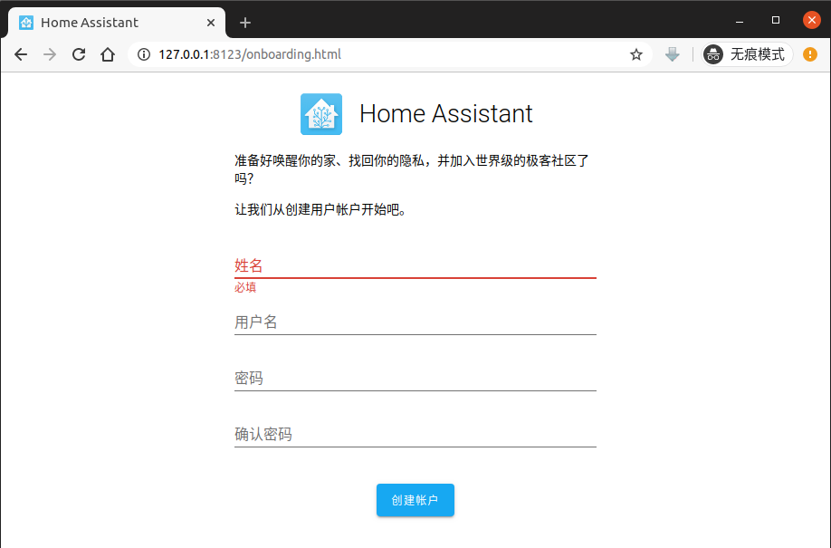
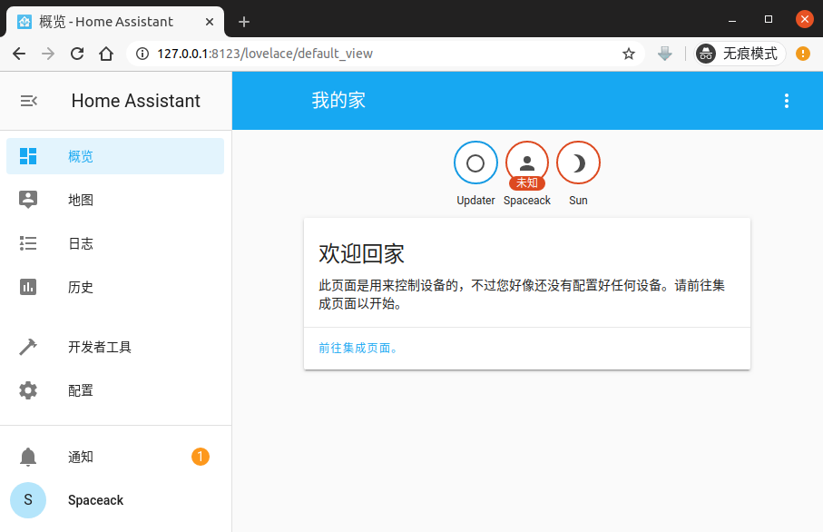
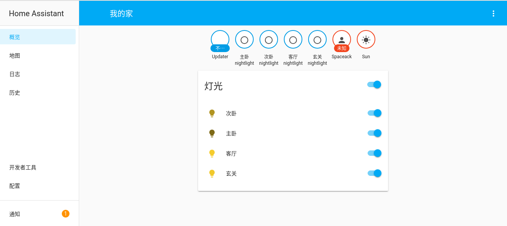
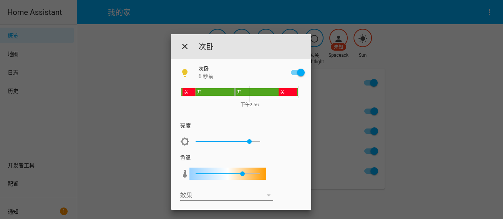
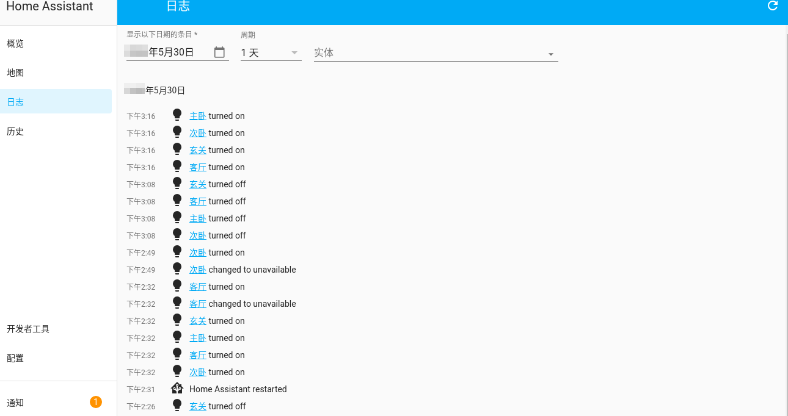
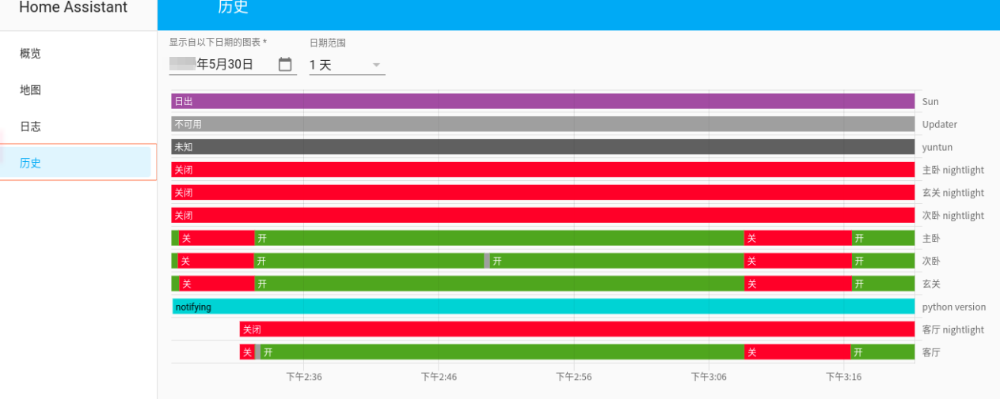

## 缘起
作为一名生命不止，折腾不息的小geek, 对享有智能生活， 掌握智能数据早已觊觎已久。奈何时间，空间，设备的限制一直未能如愿。

恰巧手头有一套`yeelight`智能吸顶灯，来发挥一直关注的`HomeAssistant`项目的威力！

今天就将智能家居这个小兴趣来作为忙碌工作生活中的调剂吧。

### HomeAssistant是什么

HomeAssistant是一套开源的家庭自动化系统，以`Python`为主要开发语言。拥有支持集成各种智能硬件设备（智能电器，传感器，监控设备，etc），自动化任务编排，数据统计等功能。拥有无限的扩展能力。

### 安装 HomeAssistant
[HomeAssistant文档](https://www.home-assistant.io/getting-started/)
```
# OS环境 Ubuntu20.04

mkdir homeAssistant
cd homeAssistant
virtualenv venv
source venv/bin/activate
pip3 install homeassistant
hass --open-ui
```
#### 注册基本信息





### 集成yeelight智能吸顶灯
[yeelight集成文档](https://www.home-assistant.io/integrations/yeelight)

#### 基本配置（手动）
配置信息写入 `/home/user/.homeassistant/configuration.yaml`

[yeelight开启局域网控制](https://www.yeelight.com/faqs/lan_control)

```yaml
yeelight:
  devices:
    192.168.1.25:
      name: 玄关
    192.168.1.26:
      name: 客厅
    192.168.1.27:
      name: 主卧
    192.168.1.28:
      name: 次卧
```
重启hass服务生效

## 默认功能一瞥


支持单个灯控制与灯组开关控制。


支持亮度控制与色温控制。


灯组及系统的开关时间记录。


以可视化图表的形式展示历史记录。