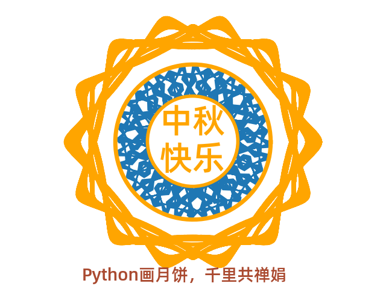
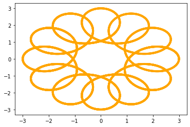
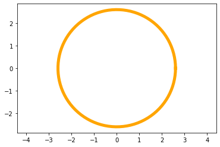
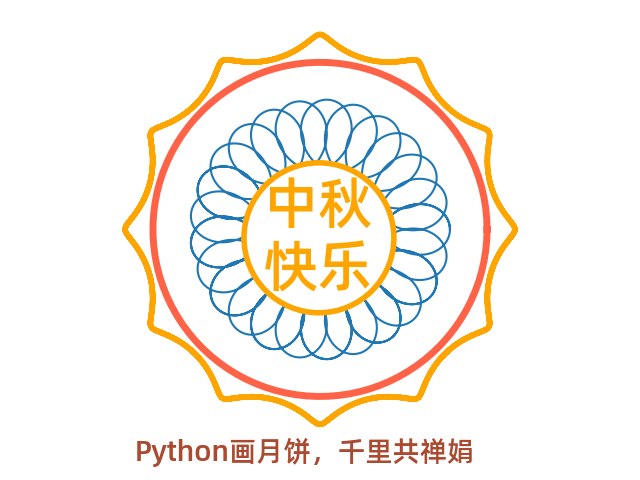
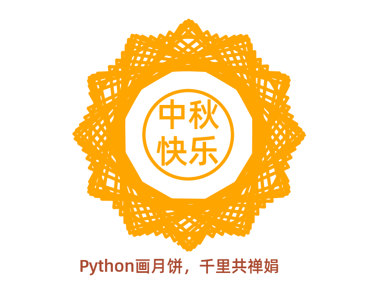
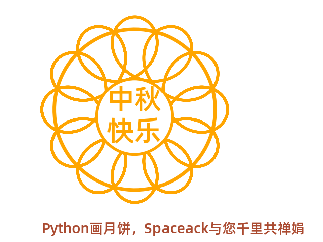
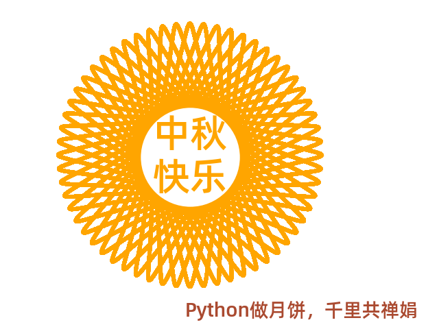

今日正值中秋节，是中国民间的传统节日。中秋节自古便有祭月、赏月、吃月饼、玩花灯、赏桂花、饮桂花酒等民俗，流传至今，经久不息。

通过参加 [画月饼过云上中秋](https://tianchi.aliyun.com/competition/entrance/531836/introduction)  Python编程活动以此纪念

完整代码和环境见 [Github matplotlib-draw-mooncake](https://github.com/spaceack/matplotlib-draw-mooncake) , 码字不易，假使该篇文章对您有所帮助，欢迎Star，以资鼓励。

## 绘制原理

利用数学解析几何中的内旋轮线（hypotrochoid），内旋轮线是追踪附着在围绕半径为 R 的固定的圆内侧滚转的半径为 r 的圆上的一个点得到的转迹线，这个点到内部滚动的圆的中心的距离是d。

繁花曲线规（万花尺，万花规）也是应用之一，大小齿轮的齿数之比，约为最简分数时，其分母就是小齿轮的自转数，分母与分子之和就是图案中的花瓣数。而分子就是小齿轮沿着大齿轮的公转数。所以，只要掌握这个最简分数，就能知道画出来的图案大概是什么形状的。总而言之，选择不同的齿轮与不同的孔，就可画出细腻、动人的各种曲线，例如玫瑰线、内摆线等等。

理论上通过玄学调参可以生成无数种图形可能。 示例如下：



## 基本步骤

1、首先我们需要导入画图和数据计算的相关库。

```python
import numpy as np
from numpy import sin, cos
from matplotlib import pyplot as plt
from matplotlib.font_manager import FontProperties
```

2、为了在图片上显示中文，需要先加载Alibaba-PuHuiTi-Medium字体。

```bash
wget http://tianchi-media.oss-cn-beijing.aliyuncs.com/DSW/Python/miniproject/01_draw_moon_cake/Alibaba-PuHuiTi-Medium.ttf
```

3、这里是核心方法，根据数学中内旋轮线（hypotrochoid）参数方程，利用lambd函数生成坐标点：

```python
x = lambda d,r,R,theta: (R-r)*np.cos(theta) + d*np.cos(((R-r)/r)*theta)
y = lambda d,r,R,theta: (R-r)*np.sin(theta) - d*np.sin(((R-r)/r)*theta)
```

4、接下来我们要画摆线，摆线是月饼边缘的花纹，首先添加相关参数，参数说明见注释： 这个参数是核心，理论上通过玄学调参可以生成无数种可能。可以尝试发挥。例如用for循环遍历 生成渐变动画～

```python
# 转数-内圆旋转次数
revs = 30
# 迭代次数， 即沿绘制路径获取的点。
Niter = 9999
thetas = np.linspace(0,revs*2*np.pi,num=Niter)

d = 2  #  距离
r = 11 # 小圆半径
R = 12 # 大圆半径
```

5、生成摆线花纹, 可通过color和linewidth参数调整颜色和线宽。

```python
plt.plot(x(d, r, R, thetas), y(d, r, R, thetas), color='orange', linewidth = '4')
```



6、然后我们再画一个圆，这个圆是月饼的主体部分。

```python
# 画个圆
length = 2.6
theta = np.linspace(0, 2 * np.pi, 100)
x = length * cos(theta)
y = length * sin(theta)
plt.plot(x, y, color='orange', linewidth = '5')
plt.axis('equal')
```



7.绘制文字，使用fontproperties参数可以使用上面下载的中文字体，因为代码不多，所以把剩余所有代码都写在这里：

```python
import numpy as np
from numpy import sin, cos
from matplotlib import pyplot as plt
from matplotlib.font_manager import FontProperties

x = lambda d,r,R,theta: (R-r)*np.cos(theta) + d*np.cos(((R-r)/r)*theta)
y = lambda d,r,R,theta: (R-r)*np.sin(theta) - d*np.sin(((R-r)/r)*theta)
# 转数-内圆旋转次数
revs = 30
# 迭代次数， 即沿绘制路径获取的点。
Niter = 9999
thetas = np.linspace(0,revs*2*np.pi,num=Niter)

d = 2  #  距离
r = 11 # 小圆半径
R = 12 # 大圆半径
plt.plot(x(d, r, R, thetas), y(d, r, R, thetas), color='orange', linewidth = '4')
length = 2.6
# 画个圆
theta = np.linspace(0, 2 * np.pi, 100)
x = length * cos(theta)
y = length * sin(theta)
plt.plot(x, y, color='orange', linewidth = '5')
plt.axis('equal')
plt.axis('off') # 隐藏坐标系
font_set = FontProperties(fname=r"Alibaba-PuHuiTi-Medium.ttf", size=12)
plt.text(-1.2, -1, '中秋\n快乐', bbox=dict(boxstyle='circle', fc="w", ec='orange', linewidth=4), fontproperties=font_set, fontsize=40, color='orange') ##ec为线条颜色，color为字体颜色,可以自由替换
plt.text(-3, -4, 'Python画月饼，Spaceack与您千里共禅娟', fontproperties=font_set, fontsize=20, color='#aa4a30')
plt.show()
```

## 图形预览

异形月饼： 弦月饼


魔法月饼


花环月饼



太阳月饼



改良月饼



向日葵月饼



丝绒月饼


---

我的博客即将同步至腾讯云+社区，邀请大家一同入驻：https://cloud.tencent.com/developer/support-plan?invite_code=vehbofwukikz