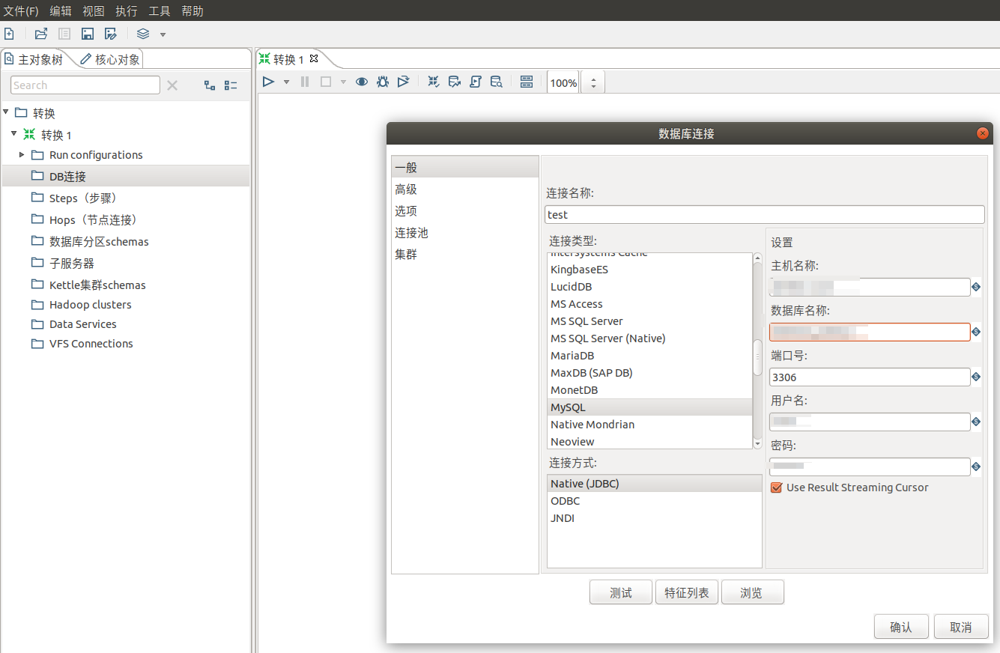
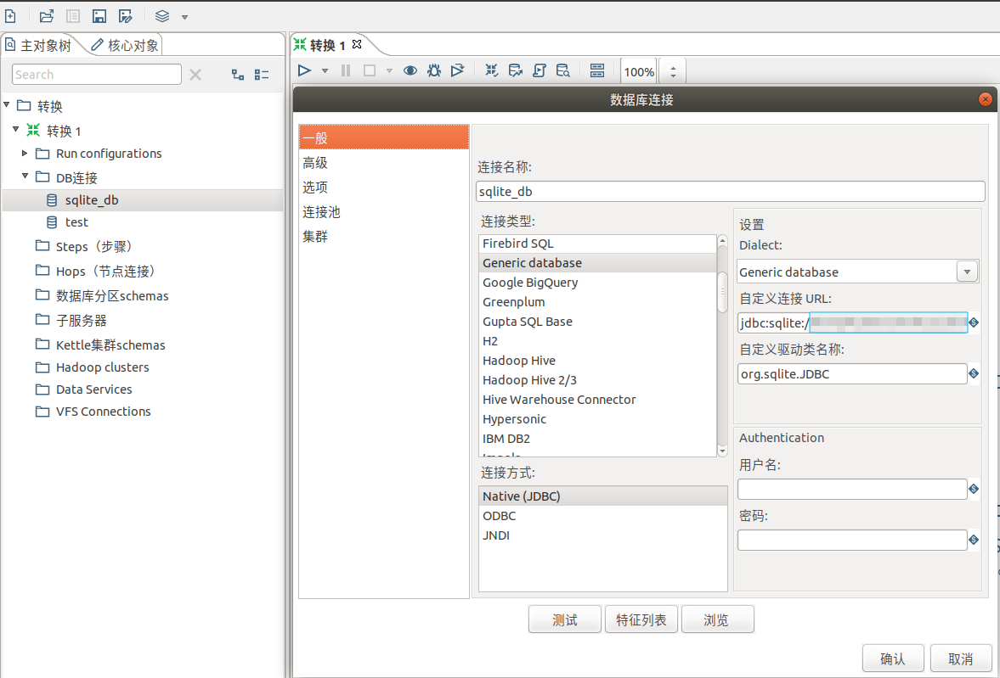
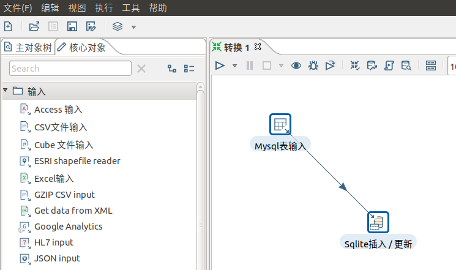
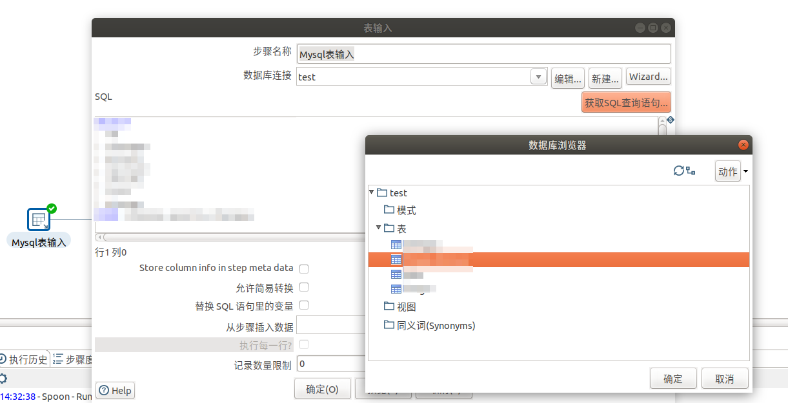
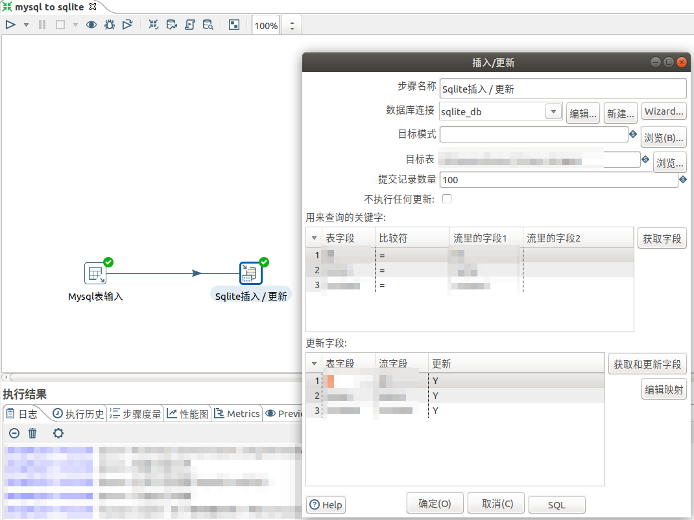
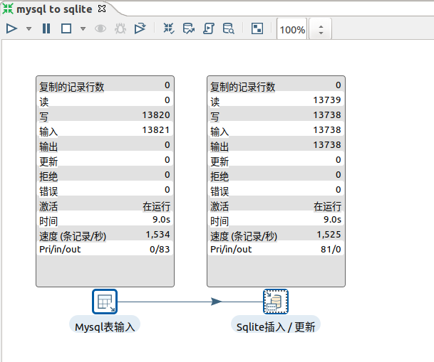
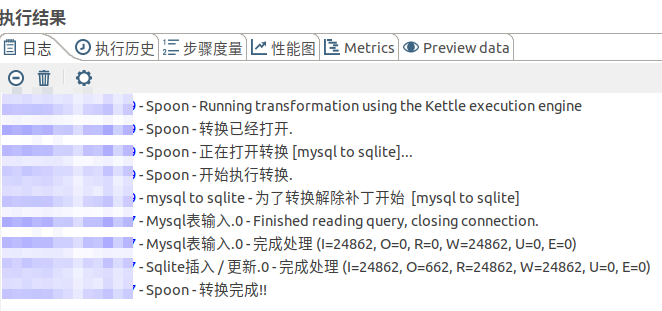

### 1.建立Mysql连接

### 2.建立Sqlite连接
自定义连接URL：jdbc:sqlite:/data/testdb.sqlite3
自定义驱动类型 `org.sqlite.JDBC`

### 3.建立抽取和插入步骤    

### 4.编辑输入步骤

### 5.编辑插入步骤
如果两边字段都完全一致kettle会自动映射匹配

### 6.运行转换，启动所有步骤：

转换完成!
