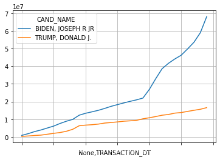

**长文预警**

首先，这是一篇面向新人的教程导向的分析文章，（by the way其实我也是新手，从比赛开始才学的Pandas库，这也是我的一篇学习笔记），所以会包含很多函数的基础用法，解题思路等等, 流程会比较详细。

其次，本文在官方教程基础上会加入创新内容，但是绝不会为了用而用某种新方法，一定本着分析数据有所帮助的原则和对数据敬畏的态度来做。

再者，为了更方便学习，请点击右上角蓝色的 Star 和 Fork 按钮。
```
[数据集下载: ](!https://tianchi.aliyun.com/competition/entrance/531837/introduction?spm=5176.12281973.1005.3.11ae1f540dSho6)
https://tianchi.aliyun.com/competition/entrance/531837/introduction?spm=5176.12281973.1005.3.11ae1f540dSho6

```
```python
# 导入相关处理包
import pandas as pd
# 加入下面这条语句可以在 JupyterLab 上渲染画布（ JupyterLab 是天池实验室的一部分）
%matplotlib inline
```
## 数据预处理
数据预处理部分包含 **数据导入**，**数据探索**，**数据整合**，**格式转换**等多个步骤。这些步骤可穿插执行。

这里第一步就是**数据导入**。

Pandas 提供的 IO 工具组支持多种数据格式类型，包括基础的 CSV，JSON，SQL 格式。

这里用到 `read_csv` 方法

此方法第一个参数为文件路径, 这里对应着天池实验室挂载的数据，因为在 **download** 同一目录下, 所以直接写文件名即可。

第二个参数 `sep` 为分隔符，用于将每行分解为若干列。默认是`,`逗号。

第三个参数 `names` 为列名列表，当文件不包含列名时使用，列名列表中不允许有重复值。

**扩展**：若我们要分析文件中包含列名呢？有个 `header` 参数可以使用，当列名是首行时，设置 `header=0`。举一反三，有时候文件首行是文件的标题，第二行才是列名，那么设置 `header=1` 即可。

将委员会和候选人一一对应，通过CAND_ID关联两个表

由于候选人和委员会的联系表中无候选人姓名，只有候选人ID（`CAND_ID`），所以需要通过`CAND_ID` 从候选人表中获取到候选人姓名，最终得到候选人与委员会联系表 `ccl`。

```python
# 读取候选人信息，由于原始数据没有表头，需要添加表头
candidates = pd.read_csv("weball20.txt", sep = '|',names=['CAND_ID','CAND_NAME','CAND_ICI','PTY_CD','CAND_PTY_AFFILIATION','TTL_RECEIPTS',
                                                          'TRANS_FROM_AUTH','TTL_DISB','TRANS_TO_AUTH','COH_BOP','COH_COP','CAND_CONTRIB',
                                                          'CAND_LOANS','OTHER_LOANS','CAND_LOAN_REPAY','OTHER_LOAN_REPAY','DEBTS_OWED_BY',
                                                          'TTL_INDIV_CONTRIB','CAND_OFFICE_ST','CAND_OFFICE_DISTRICT','SPEC_ELECTION','PRIM_ELECTION','RUN_ELECTION'
                                                          ,'GEN_ELECTION','GEN_ELECTION_PRECENT','OTHER_POL_CMTE_CONTRIB','POL_PTY_CONTRIB',
                                                          'CVG_END_DT','INDIV_REFUNDS','CMTE_REFUNDS'])
# 读取候选人和委员会的联系信息
ccl = pd.read_csv("ccl.txt", sep = '|',names=['CAND_ID','CAND_ELECTION_YR','FEC_ELECTION_YR','CMTE_ID','CMTE_TP','CMTE_DSGN','LINKAGE_ID'])
```
## 数据整合

我们现在已导入 `candidates` 候选人信息表，`ccl` 候选人与委员会关联表两张表。均为 `DataFrame` 类型。

聪明的你会发现，两个表的表头都包含 `CAND_ID` 这个字段，那么这两张表会根据这个字段有所联系。那么我们可以用 `merge` 这个神奇的方法合并两张表。

`merge` 方法有几个重要的参数如下：

1. `left `： 在这里就是我们要合并左边的 `ccl` 表。
2. `right` ： 在这里就是我们要合并右边的 `candidates` 表。
3. `how `： 这是个带有默认参数的隐藏参数，默认为 `inner` （内连接），学过 `SQL` 的同学都懂得～ 肯定还会包含 outer（外链接）、left（左连接）、right（右连接）
4. `on` ：这个参数用来连接列名，若没有其它连接项，默认会把左右两个表头的交集字段作为连接字段。下面的代码是省略的写法，也可以这样表示 `ccl = pd.merge(ccl, candidates, on="CAND_ID", how="inner")`
5. `left_on` ：用来指定左侧作为连接的表头。
6. `right_on`：用来指定右侧作为连接的表头， 下面的代码是省略的写法，也可以这样表示 `ccl = pd.merge(ccl, candidates, left_on="CAND_ID", right_on="CAND_ID", how="inner")`

```python
# 关联两个表数据
ccl = pd.merge(ccl, candidates)
# 提取出所需要的列
ccl = pd.DataFrame(ccl, columns=[ 'CMTE_ID','CAND_ID', 'CAND_NAME','CAND_PTY_AFFILIATION'])
```
```python
# 读取个人捐赠数据，由于原始数据没有表头，需要添加表头
# 提示：读取本文件大概需要5-10s
itcont = pd.read_csv('itcont_2020_20200722_20200820.txt', sep='|',names=['CMTE_ID','AMNDT_IND','RPT_TP','TRANSACTION_PGI','IMAGE_NUM','TRANSACTION_TP','ENTITY_TP','NAME','CITY','STATE','ZIP_CODE','EMPLOYER','OCCUPATION','TRANSACTION_DT','TRANSACTION_AMT','OTHER_ID','TRAN_ID','FILE_NUM','MEMO_CD','MEMO_TEXT','SUB_ID'],low_memory=False)
```
```python
# 将候选人与委员会关系表ccl和个人捐赠数据表itcont合并，通过 CMTE_ID
c_itcont =  pd.merge(ccl, itcont)
```

### 数据探索


```python
# 查看目前数据前6行, 若省略行数，默认显示5行
c_itcont.head(6)
```


<div>
<style scoped>
    .dataframe tbody tr th:only-of-type {
        vertical-align: middle;
    }

    .dataframe tbody tr th {
        vertical-align: top;
    }

    .dataframe thead th {
        text-align: right;
    }
</style>
<table border="1" class="dataframe">
  <thead>
    <tr style="text-align: right;">
      <th></th>
      <th>CMTE_ID</th>
      <th>CAND_ID</th>
      <th>CAND_NAME</th>
      <th>CAND_PTY_AFFILIATION</th>
      <th>AMNDT_IND</th>
      <th>RPT_TP</th>
      <th>TRANSACTION_PGI</th>
      <th>IMAGE_NUM</th>
      <th>TRANSACTION_TP</th>
      <th>ENTITY_TP</th>
      <th>...</th>
      <th>EMPLOYER</th>
      <th>OCCUPATION</th>
      <th>TRANSACTION_DT</th>
      <th>TRANSACTION_AMT</th>
      <th>OTHER_ID</th>
      <th>TRAN_ID</th>
      <th>FILE_NUM</th>
      <th>MEMO_CD</th>
      <th>MEMO_TEXT</th>
      <th>SUB_ID</th>
    </tr>
  </thead>
  <tbody>
    <tr>
      <th>0</th>
      <td>C00698084</td>
      <td>H0AZ02182</td>
      <td>MORGAN, JOSEPH DAVID</td>
      <td>REP</td>
      <td>A</td>
      <td>Q3</td>
      <td>P2020</td>
      <td>202010069285031369</td>
      <td>15</td>
      <td>IND</td>
      <td>...</td>
      <td>RETIRED</td>
      <td>RETIRED</td>
      <td>7242020</td>
      <td>100</td>
      <td>NaN</td>
      <td>SA11AI.4909</td>
      <td>1444070</td>
      <td>NaN</td>
      <td>NaN</td>
      <td>4100820201856947991</td>
    </tr>
    <tr>
      <th>1</th>
      <td>C00698084</td>
      <td>H0AZ02182</td>
      <td>MORGAN, JOSEPH DAVID</td>
      <td>REP</td>
      <td>A</td>
      <td>Q3</td>
      <td>P2020</td>
      <td>202010069285031369</td>
      <td>15</td>
      <td>IND</td>
      <td>...</td>
      <td>VA HOSPITAL</td>
      <td>LAB TECH</td>
      <td>7242020</td>
      <td>40</td>
      <td>NaN</td>
      <td>SA11AI.4908</td>
      <td>1444070</td>
      <td>NaN</td>
      <td>NaN</td>
      <td>4100820201856947993</td>
    </tr>
    <tr>
      <th>2</th>
      <td>C00698084</td>
      <td>H0AZ02182</td>
      <td>MORGAN, JOSEPH DAVID</td>
      <td>REP</td>
      <td>A</td>
      <td>Q3</td>
      <td>P2020</td>
      <td>202010069285031370</td>
      <td>15</td>
      <td>IND</td>
      <td>...</td>
      <td>VA HOSPITAL</td>
      <td>LAB TECH</td>
      <td>7312020</td>
      <td>40</td>
      <td>NaN</td>
      <td>SA11AI.4916</td>
      <td>1444070</td>
      <td>NaN</td>
      <td>NaN</td>
      <td>4100820201856947994</td>
    </tr>
    <tr>
      <th>3</th>
      <td>C00725697</td>
      <td>H0AZ03461</td>
      <td>WOOD, DANIEL</td>
      <td>REP</td>
      <td>A</td>
      <td>Q3</td>
      <td>G2020</td>
      <td>202010079285052516</td>
      <td>15</td>
      <td>IND</td>
      <td>...</td>
      <td>POWERS-LEAVITT</td>
      <td>INSURANCE AGENT</td>
      <td>8102020</td>
      <td>300</td>
      <td>NaN</td>
      <td>SA11AI.4683</td>
      <td>1444556</td>
      <td>NaN</td>
      <td>NaN</td>
      <td>4100920201857257629</td>
    </tr>
    <tr>
      <th>4</th>
      <td>C00725697</td>
      <td>H0AZ03461</td>
      <td>WOOD, DANIEL</td>
      <td>REP</td>
      <td>A</td>
      <td>Q3</td>
      <td>G2020</td>
      <td>202010079285052518</td>
      <td>15</td>
      <td>IND</td>
      <td>...</td>
      <td>UNEMPLOYED</td>
      <td>NaN</td>
      <td>8072020</td>
      <td>500</td>
      <td>NaN</td>
      <td>SA11AI.4612</td>
      <td>1444556</td>
      <td>NaN</td>
      <td>NaN</td>
      <td>4100920201857257635</td>
    </tr>
    <tr>
      <th>5</th>
      <td>C00725697</td>
      <td>H0AZ03461</td>
      <td>WOOD, DANIEL</td>
      <td>REP</td>
      <td>A</td>
      <td>Q3</td>
      <td>G2020</td>
      <td>202010079285052519</td>
      <td>15</td>
      <td>IND</td>
      <td>...</td>
      <td>SELF-EMPLOYED</td>
      <td>DVM</td>
      <td>7312020</td>
      <td>500</td>
      <td>NaN</td>
      <td>SA11AI.4593</td>
      <td>1444556</td>
      <td>NaN</td>
      <td>NaN</td>
      <td>4100920201857257636</td>
    </tr>
  </tbody>
</table>
<p>6 rows × 24 columns</p>
</div>


```python
# 查看目前数据后3行, 若省略行数，默认显示5行
c_itcont.head(n=3)
```


<div>
<style scoped>
    .dataframe tbody tr th:only-of-type {
        vertical-align: middle;
    }

    .dataframe tbody tr th {
        vertical-align: top;
    }

    .dataframe thead th {
        text-align: right;
    }
</style>
<table border="1" class="dataframe">
  <thead>
    <tr style="text-align: right;">
      <th></th>
      <th>CMTE_ID</th>
      <th>CAND_ID</th>
      <th>CAND_NAME</th>
      <th>CAND_PTY_AFFILIATION</th>
      <th>AMNDT_IND</th>
      <th>RPT_TP</th>
      <th>TRANSACTION_PGI</th>
      <th>IMAGE_NUM</th>
      <th>TRANSACTION_TP</th>
      <th>ENTITY_TP</th>
      <th>...</th>
      <th>EMPLOYER</th>
      <th>OCCUPATION</th>
      <th>TRANSACTION_DT</th>
      <th>TRANSACTION_AMT</th>
      <th>OTHER_ID</th>
      <th>TRAN_ID</th>
      <th>FILE_NUM</th>
      <th>MEMO_CD</th>
      <th>MEMO_TEXT</th>
      <th>SUB_ID</th>
    </tr>
  </thead>
  <tbody>
    <tr>
      <th>0</th>
      <td>C00698084</td>
      <td>H0AZ02182</td>
      <td>MORGAN, JOSEPH DAVID</td>
      <td>REP</td>
      <td>A</td>
      <td>Q3</td>
      <td>P2020</td>
      <td>202010069285031369</td>
      <td>15</td>
      <td>IND</td>
      <td>...</td>
      <td>RETIRED</td>
      <td>RETIRED</td>
      <td>7242020</td>
      <td>100</td>
      <td>NaN</td>
      <td>SA11AI.4909</td>
      <td>1444070</td>
      <td>NaN</td>
      <td>NaN</td>
      <td>4100820201856947991</td>
    </tr>
    <tr>
      <th>1</th>
      <td>C00698084</td>
      <td>H0AZ02182</td>
      <td>MORGAN, JOSEPH DAVID</td>
      <td>REP</td>
      <td>A</td>
      <td>Q3</td>
      <td>P2020</td>
      <td>202010069285031369</td>
      <td>15</td>
      <td>IND</td>
      <td>...</td>
      <td>VA HOSPITAL</td>
      <td>LAB TECH</td>
      <td>7242020</td>
      <td>40</td>
      <td>NaN</td>
      <td>SA11AI.4908</td>
      <td>1444070</td>
      <td>NaN</td>
      <td>NaN</td>
      <td>4100820201856947993</td>
    </tr>
    <tr>
      <th>2</th>
      <td>C00698084</td>
      <td>H0AZ02182</td>
      <td>MORGAN, JOSEPH DAVID</td>
      <td>REP</td>
      <td>A</td>
      <td>Q3</td>
      <td>P2020</td>
      <td>202010069285031370</td>
      <td>15</td>
      <td>IND</td>
      <td>...</td>
      <td>VA HOSPITAL</td>
      <td>LAB TECH</td>
      <td>7312020</td>
      <td>40</td>
      <td>NaN</td>
      <td>SA11AI.4916</td>
      <td>1444070</td>
      <td>NaN</td>
      <td>NaN</td>
      <td>4100820201856947994</td>
    </tr>
  </tbody>
</table>
<p>3 rows × 24 columns</p>
</div>


```python
# 查看数据规模 多少行 多少列
c_itcont.shape
```


    (756205, 24)


```python
# 查看整体数据信息，包括每个字段的名称、非空数量、字段的数据类型
c_itcont.info()
```

    <class 'pandas.core.frame.DataFrame'>
    Int64Index: 756205 entries, 0 to 756204
    Data columns (total 24 columns):
    CMTE_ID                 756205 non-null object
    CAND_ID                 756205 non-null object
    CAND_NAME               756205 non-null object
    CAND_PTY_AFFILIATION    756205 non-null object
    AMNDT_IND               756205 non-null object
    RPT_TP                  756205 non-null object
    TRANSACTION_PGI         756205 non-null object
    IMAGE_NUM               756205 non-null int64
    TRANSACTION_TP          756205 non-null object
    ENTITY_TP               756205 non-null object
    NAME                    756205 non-null object
    CITY                    756159 non-null object
    STATE                   756160 non-null object
    ZIP_CODE                756092 non-null object
    EMPLOYER                737413 non-null object
    OCCUPATION              741294 non-null object
    TRANSACTION_DT          756205 non-null int64
    TRANSACTION_AMT         756205 non-null int64
    OTHER_ID                647200 non-null object
    TRAN_ID                 756205 non-null object
    FILE_NUM                756205 non-null int64
    MEMO_CD                 220 non-null object
    MEMO_TEXT               655693 non-null object
    SUB_ID                  756205 non-null int64
    dtypes: int64(5), object(19)
    memory usage: 144.2+ MB


```python
# 查看数据表中数据类型的列的数据分布情况
c_itcont.describe()
```


<div>
<style scoped>
    .dataframe tbody tr th:only-of-type {
        vertical-align: middle;
    }

    .dataframe tbody tr th {
        vertical-align: top;
    }

    .dataframe thead th {
        text-align: right;
    }
</style>
<table border="1" class="dataframe">
  <thead>
    <tr style="text-align: right;">
      <th></th>
      <th>IMAGE_NUM</th>
      <th>TRANSACTION_DT</th>
      <th>TRANSACTION_AMT</th>
      <th>FILE_NUM</th>
      <th>SUB_ID</th>
    </tr>
  </thead>
  <tbody>
    <tr>
      <th>count</th>
      <td>7.562050e+05</td>
      <td>7.562050e+05</td>
      <td>7.562050e+05</td>
      <td>7.562050e+05</td>
      <td>7.562050e+05</td>
    </tr>
    <tr>
      <th>mean</th>
      <td>2.020090e+17</td>
      <td>7.887799e+06</td>
      <td>1.504307e+02</td>
      <td>1.439133e+06</td>
      <td>4.091288e+18</td>
    </tr>
    <tr>
      <th>std</th>
      <td>4.071886e+11</td>
      <td>3.857874e+05</td>
      <td>2.320452e+03</td>
      <td>2.325325e+03</td>
      <td>4.642365e+15</td>
    </tr>
    <tr>
      <th>min</th>
      <td>2.020072e+17</td>
      <td>7.222020e+06</td>
      <td>-5.600000e+03</td>
      <td>1.427865e+06</td>
      <td>4.072420e+18</td>
    </tr>
    <tr>
      <th>25%</th>
      <td>2.020092e+17</td>
      <td>7.312020e+06</td>
      <td>2.000000e+01</td>
      <td>1.440015e+06</td>
      <td>4.092520e+18</td>
    </tr>
    <tr>
      <th>50%</th>
      <td>2.020092e+17</td>
      <td>8.102020e+06</td>
      <td>3.500000e+01</td>
      <td>1.440320e+06</td>
      <td>4.093020e+18</td>
    </tr>
    <tr>
      <th>75%</th>
      <td>2.020092e+17</td>
      <td>8.152020e+06</td>
      <td>1.000000e+02</td>
      <td>1.440320e+06</td>
      <td>4.093020e+18</td>
    </tr>
    <tr>
      <th>max</th>
      <td>2.020101e+17</td>
      <td>8.202020e+06</td>
      <td>1.500000e+06</td>
      <td>1.445380e+06</td>
      <td>4.101020e+18</td>
    </tr>
  </tbody>
</table>
</div>


### 格式转换


```python
#空值处理，统一填充 NOT PROVIDED
c_itcont['STATE'].fillna('NOT PROVIDED',inplace=True)
c_itcont['EMPLOYER'].fillna('NOT PROVIDED',inplace=True)
c_itcont['OCCUPATION'].fillna('NOT PROVIDED',inplace=True)
# 对日期TRANSACTION_DT列进行处理
c_itcont['TRANSACTION_DT'] = c_itcont['TRANSACTION_DT'] .astype(str)
# 将日期格式改为年月日  7242020	
c_itcont['TRANSACTION_DT'] = [i[3:7]+i[0]+i[1:3] for i in c_itcont['TRANSACTION_DT'] ]
```

## 绘制收到捐赠额最多的两位候选人的总捐赠额变化趋势图


```python
# 计算每个总统候选人所获得的捐款总额，然后排序，取前二位
c_itcont.groupby("CAND_NAME").sum().sort_values("TRANSACTION_AMT",ascending=False).head(2)
```


<div>
<style scoped>
    .dataframe tbody tr th:only-of-type {
        vertical-align: middle;
    }

    .dataframe tbody tr th {
        vertical-align: top;
    }

    .dataframe thead th {
        text-align: right;
    }
</style>
<table border="1" class="dataframe">
  <thead>
    <tr style="text-align: right;">
      <th></th>
      <th>IMAGE_NUM</th>
      <th>TRANSACTION_AMT</th>
      <th>FILE_NUM</th>
      <th>SUB_ID</th>
    </tr>
    <tr>
      <th>CAND_NAME</th>
      <th></th>
      <th></th>
      <th></th>
      <th></th>
    </tr>
  </thead>
  <tbody>
    <tr>
      <th>BIDEN, JOSEPH R JR</th>
      <td>1.025834e+23</td>
      <td>68111142.0</td>
      <td>7.307496e+11</td>
      <td>2.077270e+24</td>
    </tr>
    <tr>
      <th>TRUMP, DONALD J.</th>
      <td>1.181873e+22</td>
      <td>16594982.0</td>
      <td>8.417584e+10</td>
      <td>2.396038e+23</td>
    </tr>
  </tbody>
</table>
</div>


```python
# 提取需要的数据列
c_itcont0 = pd.DataFrame(c_itcont, columns=[ 'CAND_NAME', 'TRANSACTION_AMT', 'TRANSACTION_DT'])

```


```python
# 已知所获得的捐款总额前两位的总统候选人分别是'BIDEN, JOSEPH R JR', 'TRUMP, DONALD J.'， 筛选出来
c_itcont1 = c_itcont0[c_itcont0['CAND_NAME'].isin(['BIDEN, JOSEPH R JR', 'TRUMP, DONALD J.'])]

```


```python
# 因为同一天会有多笔捐款入帐，需要做分组求和
c_itcont2 = c_itcont1.groupby(['CAND_NAME', 'TRANSACTION_DT']).sum()

```


```python
# 因为我们要看总额的趋势图，所以要做累加
c_itcont3 = c_itcont2.groupby(['CAND_NAME', ]).cumsum()

```


```python
# 现在很快可以达到预期目标了
c_itcont3
```


<div>
<style scoped>
    .dataframe tbody tr th:only-of-type {
        vertical-align: middle;
    }

    .dataframe tbody tr th {
        vertical-align: top;
    }

    .dataframe thead th {
        text-align: right;
    }
</style>
<table border="1" class="dataframe">
  <thead>
    <tr style="text-align: right;">
      <th></th>
      <th></th>
      <th>TRANSACTION_AMT</th>
    </tr>
    <tr>
      <th>CAND_NAME</th>
      <th>TRANSACTION_DT</th>
      <th></th>
    </tr>
  </thead>
  <tbody>
    <tr>
      <th rowspan="30" valign="top">BIDEN, JOSEPH R JR</th>
      <th>2020722</th>
      <td>888622</td>
    </tr>
    <tr>
      <th>2020723</th>
      <td>1852227</td>
    </tr>
    <tr>
      <th>2020724</th>
      <td>3024292</td>
    </tr>
    <tr>
      <th>2020725</th>
      <td>3943847</td>
    </tr>
    <tr>
      <th>2020726</th>
      <td>5052629</td>
    </tr>
    <tr>
      <th>2020727</th>
      <td>6150050</td>
    </tr>
    <tr>
      <th>2020728</th>
      <td>7625248</td>
    </tr>
    <tr>
      <th>2020729</th>
      <td>8900851</td>
    </tr>
    <tr>
      <th>2020730</th>
      <td>9964382</td>
    </tr>
    <tr>
      <th>2020731</th>
      <td>12305972</td>
    </tr>
    <tr>
      <th>2020801</th>
      <td>13391021</td>
    </tr>
    <tr>
      <th>2020802</th>
      <td>14208260</td>
    </tr>
    <tr>
      <th>2020803</th>
      <td>15063070</td>
    </tr>
    <tr>
      <th>2020804</th>
      <td>16138452</td>
    </tr>
    <tr>
      <th>2020805</th>
      <td>17317433</td>
    </tr>
    <tr>
      <th>2020806</th>
      <td>18293448</td>
    </tr>
    <tr>
      <th>2020807</th>
      <td>19246279</td>
    </tr>
    <tr>
      <th>2020808</th>
      <td>20152637</td>
    </tr>
    <tr>
      <th>2020809</th>
      <td>20996972</td>
    </tr>
    <tr>
      <th>2020810</th>
      <td>22015682</td>
    </tr>
    <tr>
      <th>2020811</th>
      <td>26905056</td>
    </tr>
    <tr>
      <th>2020812</th>
      <td>32932121</td>
    </tr>
    <tr>
      <th>2020813</th>
      <td>38604052</td>
    </tr>
    <tr>
      <th>2020814</th>
      <td>41666574</td>
    </tr>
    <tr>
      <th>2020815</th>
      <td>44125928</td>
    </tr>
    <tr>
      <th>2020816</th>
      <td>46254874</td>
    </tr>
    <tr>
      <th>2020817</th>
      <td>49826137</td>
    </tr>
    <tr>
      <th>2020818</th>
      <td>53584270</td>
    </tr>
    <tr>
      <th>2020819</th>
      <td>58989963</td>
    </tr>
    <tr>
      <th>2020820</th>
      <td>68111142</td>
    </tr>
    <tr>
      <th rowspan="30" valign="top">TRUMP, DONALD J.</th>
      <th>2020722</th>
      <td>330603</td>
    </tr>
    <tr>
      <th>2020723</th>
      <td>554920</td>
    </tr>
    <tr>
      <th>2020724</th>
      <td>828209</td>
    </tr>
    <tr>
      <th>2020725</th>
      <td>1035861</td>
    </tr>
    <tr>
      <th>2020726</th>
      <td>1529042</td>
    </tr>
    <tr>
      <th>2020727</th>
      <td>2044076</td>
    </tr>
    <tr>
      <th>2020728</th>
      <td>2499171</td>
    </tr>
    <tr>
      <th>2020729</th>
      <td>3216022</td>
    </tr>
    <tr>
      <th>2020730</th>
      <td>4346359</td>
    </tr>
    <tr>
      <th>2020731</th>
      <td>6338855</td>
    </tr>
    <tr>
      <th>2020801</th>
      <td>6688166</td>
    </tr>
    <tr>
      <th>2020802</th>
      <td>6925401</td>
    </tr>
    <tr>
      <th>2020803</th>
      <td>7273299</td>
    </tr>
    <tr>
      <th>2020804</th>
      <td>7862177</td>
    </tr>
    <tr>
      <th>2020805</th>
      <td>8175442</td>
    </tr>
    <tr>
      <th>2020806</th>
      <td>8501605</td>
    </tr>
    <tr>
      <th>2020807</th>
      <td>8899471</td>
    </tr>
    <tr>
      <th>2020808</th>
      <td>9124955</td>
    </tr>
    <tr>
      <th>2020809</th>
      <td>9404411</td>
    </tr>
    <tr>
      <th>2020810</th>
      <td>10286254</td>
    </tr>
    <tr>
      <th>2020811</th>
      <td>10856855</td>
    </tr>
    <tr>
      <th>2020812</th>
      <td>11540551</td>
    </tr>
    <tr>
      <th>2020813</th>
      <td>12298919</td>
    </tr>
    <tr>
      <th>2020814</th>
      <td>12717476</td>
    </tr>
    <tr>
      <th>2020815</th>
      <td>13483142</td>
    </tr>
    <tr>
      <th>2020816</th>
      <td>13812398</td>
    </tr>
    <tr>
      <th>2020817</th>
      <td>14453930</td>
    </tr>
    <tr>
      <th>2020818</th>
      <td>15086445</td>
    </tr>
    <tr>
      <th>2020819</th>
      <td>15665254</td>
    </tr>
    <tr>
      <th>2020820</th>
      <td>16594982</td>
    </tr>
  </tbody>
</table>
</div>


```python
# 整理下排列索引，这里用到了索引和列标题转换与转置操作
c_itcont4 = c_itcont3.unstack().T
c_itcont4
```


<div>
<style scoped>
    .dataframe tbody tr th:only-of-type {
        vertical-align: middle;
    }

    .dataframe tbody tr th {
        vertical-align: top;
    }

    .dataframe thead th {
        text-align: right;
    }
</style>
<table border="1" class="dataframe">
  <thead>
    <tr style="text-align: right;">
      <th></th>
      <th>CAND_NAME</th>
      <th>BIDEN, JOSEPH R JR</th>
      <th>TRUMP, DONALD J.</th>
    </tr>
    <tr>
      <th></th>
      <th>TRANSACTION_DT</th>
      <th></th>
      <th></th>
    </tr>
  </thead>
  <tbody>
    <tr>
      <th rowspan="30" valign="top">TRANSACTION_AMT</th>
      <th>2020722</th>
      <td>888622</td>
      <td>330603</td>
    </tr>
    <tr>
      <th>2020723</th>
      <td>1852227</td>
      <td>554920</td>
    </tr>
    <tr>
      <th>2020724</th>
      <td>3024292</td>
      <td>828209</td>
    </tr>
    <tr>
      <th>2020725</th>
      <td>3943847</td>
      <td>1035861</td>
    </tr>
    <tr>
      <th>2020726</th>
      <td>5052629</td>
      <td>1529042</td>
    </tr>
    <tr>
      <th>2020727</th>
      <td>6150050</td>
      <td>2044076</td>
    </tr>
    <tr>
      <th>2020728</th>
      <td>7625248</td>
      <td>2499171</td>
    </tr>
    <tr>
      <th>2020729</th>
      <td>8900851</td>
      <td>3216022</td>
    </tr>
    <tr>
      <th>2020730</th>
      <td>9964382</td>
      <td>4346359</td>
    </tr>
    <tr>
      <th>2020731</th>
      <td>12305972</td>
      <td>6338855</td>
    </tr>
    <tr>
      <th>2020801</th>
      <td>13391021</td>
      <td>6688166</td>
    </tr>
    <tr>
      <th>2020802</th>
      <td>14208260</td>
      <td>6925401</td>
    </tr>
    <tr>
      <th>2020803</th>
      <td>15063070</td>
      <td>7273299</td>
    </tr>
    <tr>
      <th>2020804</th>
      <td>16138452</td>
      <td>7862177</td>
    </tr>
    <tr>
      <th>2020805</th>
      <td>17317433</td>
      <td>8175442</td>
    </tr>
    <tr>
      <th>2020806</th>
      <td>18293448</td>
      <td>8501605</td>
    </tr>
    <tr>
      <th>2020807</th>
      <td>19246279</td>
      <td>8899471</td>
    </tr>
    <tr>
      <th>2020808</th>
      <td>20152637</td>
      <td>9124955</td>
    </tr>
    <tr>
      <th>2020809</th>
      <td>20996972</td>
      <td>9404411</td>
    </tr>
    <tr>
      <th>2020810</th>
      <td>22015682</td>
      <td>10286254</td>
    </tr>
    <tr>
      <th>2020811</th>
      <td>26905056</td>
      <td>10856855</td>
    </tr>
    <tr>
      <th>2020812</th>
      <td>32932121</td>
      <td>11540551</td>
    </tr>
    <tr>
      <th>2020813</th>
      <td>38604052</td>
      <td>12298919</td>
    </tr>
    <tr>
      <th>2020814</th>
      <td>41666574</td>
      <td>12717476</td>
    </tr>
    <tr>
      <th>2020815</th>
      <td>44125928</td>
      <td>13483142</td>
    </tr>
    <tr>
      <th>2020816</th>
      <td>46254874</td>
      <td>13812398</td>
    </tr>
    <tr>
      <th>2020817</th>
      <td>49826137</td>
      <td>14453930</td>
    </tr>
    <tr>
      <th>2020818</th>
      <td>53584270</td>
      <td>15086445</td>
    </tr>
    <tr>
      <th>2020819</th>
      <td>58989963</td>
      <td>15665254</td>
    </tr>
    <tr>
      <th>2020820</th>
      <td>68111142</td>
      <td>16594982</td>
    </tr>
  </tbody>
</table>
</div>


绘制收到捐赠额最多的两位候选人的总捐赠额变化趋势图

这里使用 `plot` 方法绘制趋势图，（由于天池实验室环境不是最新的库，兼容问题会报警告，但是不影响出图。 我在其它环境测试没问题，图的横坐标会有日期显示的。）


```python
# grid参数 用来显示后面的辅助网格线， rot 使横坐标的日期以45度排列， 不会导致产生字符过长导致叠加的问题。（由于天池实验室环境不是最新的库，兼容问题会报警告，横坐标的日期标注无法显示。）
c_itcont4.plot(grid=True, rot=45)
```


### 结论

由趋势图可以看出，在7月22日至8月20日期间，拜登收到的捐款总额明显高于特朗普。且在8月份有更为显著的变化。


## 使用桑基图分析美国各州对党派的贡献度


桑基图（Sankey），即桑基能量分流图，是一种高级可视化图形。常用于金融等数据的可视化分析。最明显的特征就是，始末端的分支宽度总和相等，即所有主支宽度的总和应与所有分出去的分支宽度的总和相等，保持能量的平衡。

一个州的捐款额可能会流向不同的党派，用桑基图表示的效果就非常好。可以很清楚看出某个党派的贡献流向。

这里要用到第三方库 `pyecharts`，用来画桑吉图比较方便，还支持交互式操作（鼠标悬停某条能量线高亮并显示金额数量），首先安装第三方库


```python
!pip install pyecharts --user
```

    Looking in indexes: https://mirrors.aliyun.com/pypi/simple
    Requirement already satisfied: pyecharts in /data/nas/workspace/envs/python3.6/site-packages (1.9.0)
    Requirement already satisfied: prettytable in /data/nas/workspace/envs/python3.6/site-packages (from pyecharts) (1.0.1)
    Requirement already satisfied: simplejson in /data/nas/workspace/envs/python3.6/site-packages (from pyecharts) (3.17.2)
    Requirement already satisfied: jinja2 in /opt/conda/lib/python3.6/site-packages (from pyecharts) (2.11.2)
    Requirement already satisfied: setuptools in /opt/conda/lib/python3.6/site-packages (from prettytable->pyecharts) (49.6.0)
    Requirement already satisfied: wcwidth in /opt/conda/lib/python3.6/site-packages (from prettytable->pyecharts) (0.2.5)
    Requirement already satisfied: MarkupSafe>=0.23 in /opt/conda/lib/python3.6/site-packages (from jinja2->pyecharts) (1.1.1)


```python
# 提取需要的数据列
c_itcont5 = pd.DataFrame(c_itcont, columns=[ 'STATE', 'TRANSACTION_AMT', 'CAND_PTY_AFFILIATION'])
```


```python
# 提取党派集合
c_itcont_CAND_PTY_AFFILIATION = pd.DataFrame(c_itcont5,columns=['CAND_PTY_AFFILIATION'])
cgc = c_itcont_CAND_PTY_AFFILIATION.groupby('CAND_PTY_AFFILIATION').count()
node2 = list(cgc.index)
node2
```


    ['BDY',
     'CON',
     'DEM',
     'DFL',
     'GRE',
     'IND',
     'LIB',
     'NON',
     'NPA',
     'OTH',
     'REP',
     'UNK']


```python
# 提取州集合
c_itcont_STATE = pd.DataFrame(c_itcont5,columns=['STATE'])
sgc = c_itcont_STATE.groupby('STATE').count()
node1 = list(sgc.index)
```


```python
# 为方便阅读， 引入汉化字典
scp = {'AA': '美洲军',
 'AE': '军事地区',
 'AK': '阿拉斯加州',
 'AL': '阿拉巴马州',
 'AP': '太平洋军事机构',
 'AR': '阿肯色州',
 'AS': '美属萨摩亚群岛',
 'AZ': '阿利桑那州',
 'CA': '加利福尼亚州',
 'CO': '科罗拉多州',
 'CT': '康涅狄格州',
 'DC': '华盛顿DC',
 'DE': '特拉华州',
 'FL': '佛罗里达州',
 'FM': 'FM联邦',
 'GA': '乔治亚州',
 'GU': '关岛',
 'HI': '夏威夷州',
 'IA': '爱荷华州',
 'ID': '爱达荷州',
 'IL': '伊利诺斯州',
 'IN': '印第安纳州',
 'KS': '堪萨斯州',
 'KY': 'KY',
 'LA': '路易斯安那州',
 'MA': '马萨诸塞州',
 'MD': '马里兰州',
 'ME': '缅因州',
 'MI': '密歇根州',
 'MN': '明尼苏达州',
 'MO': '密苏里州',
 'MP': 'MP',
 'MS': '密西西比州',
 'MT': '蒙大拿州',
 'NC': '北卡罗来纳州',
 'ND': '北达科他州',
 'NE': '内布拉斯加州',
 'NH': '新罕布什尔州',
 'NJ': '新泽西州',
 'NM': '新墨西哥州',
 'NOT PROVIDED': 'NOT PROVIDED',
 'NV': '内华达州',
 'NY': '纽约州',
 'OH': '俄亥俄州',
 'OK': 'OK',
 'OR': '俄勒冈州',
 'PA': '宾夕法尼亚州',
 'PR': 'PR',
 'PW': 'PW',
 'RI': '罗得岛州',
 'SC': '南卡罗来纳州',
 'SD': '南达科他州',
 'TN': '田纳西州',
 'TX': '得克萨斯州',
 'UT': '犹他州',
 'VA': '弗吉尼亚州',
 'VI': 'VI',
 'VT': '佛蒙特州',
 'WA': '华盛顿州',
 'WI': '威斯康辛州',
 'WV': '西弗吉尼亚州',
 'WY': '怀俄明州',
 'ZZ': 'ZZ'}

```


```python
# 将集合加入到节点列表，nodes需要把桑基图中出现的名称全部设置进去，并且要保证links中的名称与name相同
nodes = []
for n in node1:
    nodes.append({'name': scp[n]})
for n in node2:
    nodes.append({'name': n})
```


```python
# 做分组聚合
cgs = c_itcont5.groupby(['STATE','CAND_PTY_AFFILIATION']).sum()
```


```python
# 将聚合结果加入到链接列表， links代表节点关系，source表示起点，target表示终点，需要将节点关系全部输入进去，value表示节点长度
links = []
for row in cgs.iterrows():
    links.append({'source': scp[row[0][0]], 'target': row[0][1], 'value': int(row[1][0])})
```


```python
from pyecharts import options as opts
from pyecharts.charts import Page, Sankey
```


```python
sankey = Sankey(init_opts=opts.InitOpts(width="1024", height="768"))		#可以设置大小和图标名称
sankey.add(
    '各州捐款额流向图',				#名称
    nodes,					#输入节点，如果导入json数据，nodes=json['nodes]
    links,					#输入关系,nodes=json['links']
    linestyle_opt=opts.LineStyleOpts(opacity=0.3, curve=0.5, color="source", width=10),
    label_opts=opts.LabelOpts(position="right", is_show=True, color='red'),
    node_gap=1
)
sankey.render()
# 生成的桑基图可通过下方目录查看
```


    '/data/nas/workspace/jupyter/download/render.html'


### 结论

由各州全款额流向图可以非常快速的得知：加利福尼亚州，纽约州，马萨诸塞州在7月22日至8月20日是对民主党贡献最多的三大州。

佛罗里达州和德克萨斯州对两大党的贡献几乎相同，但更倾向于共和党，也是对共和党贡献较大的两个州。

桑基图会包含很多数据元素，通过桑基图可以探索更多的数据，例如去除两大党的情况和仅比较两大党的情况等等。
